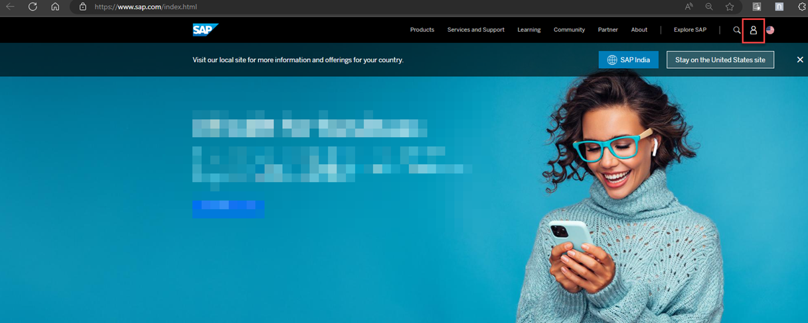
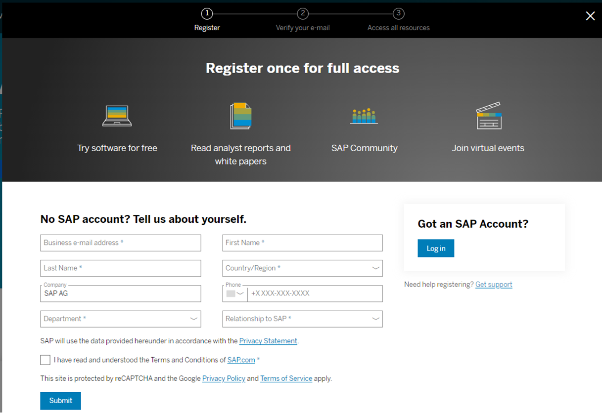
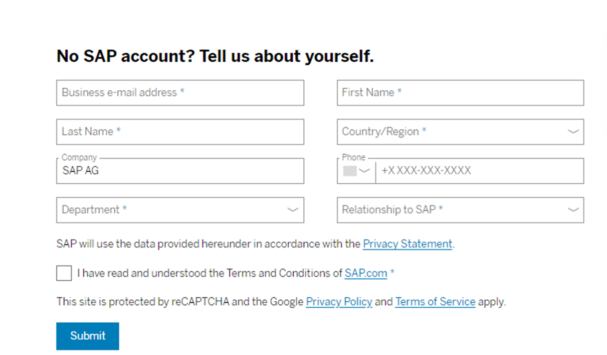
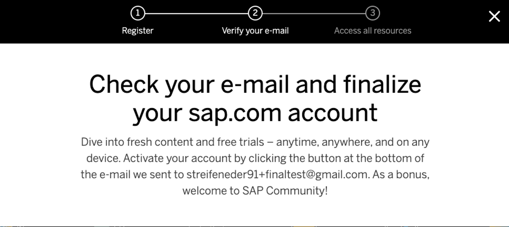
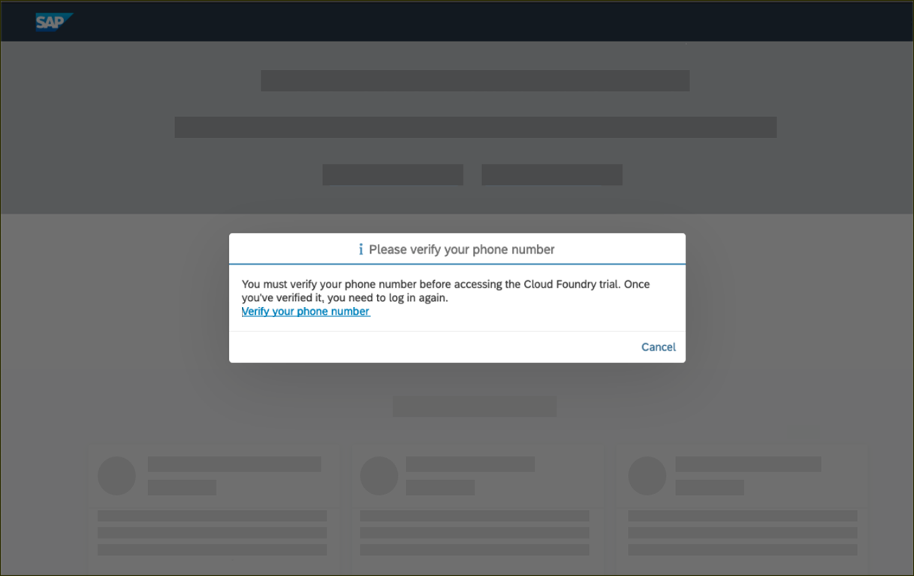
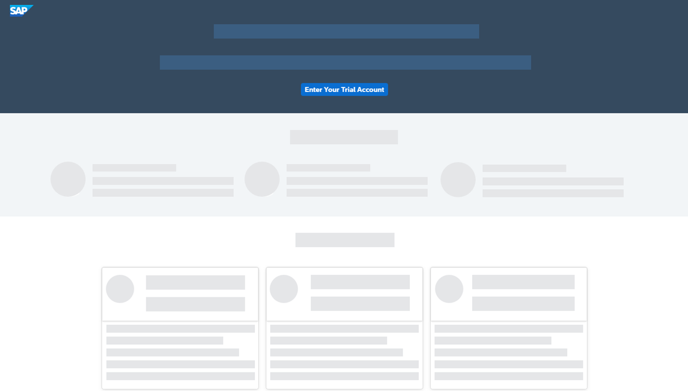
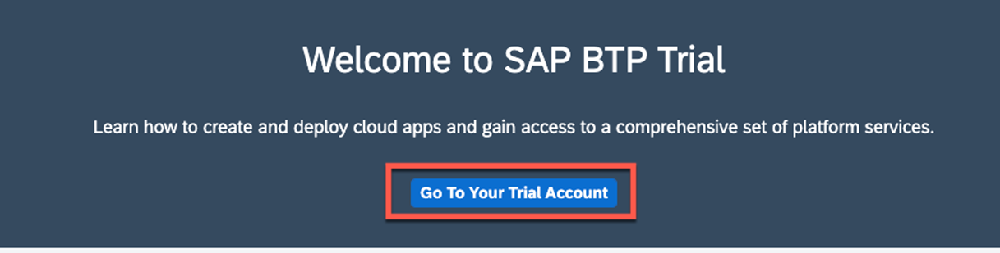
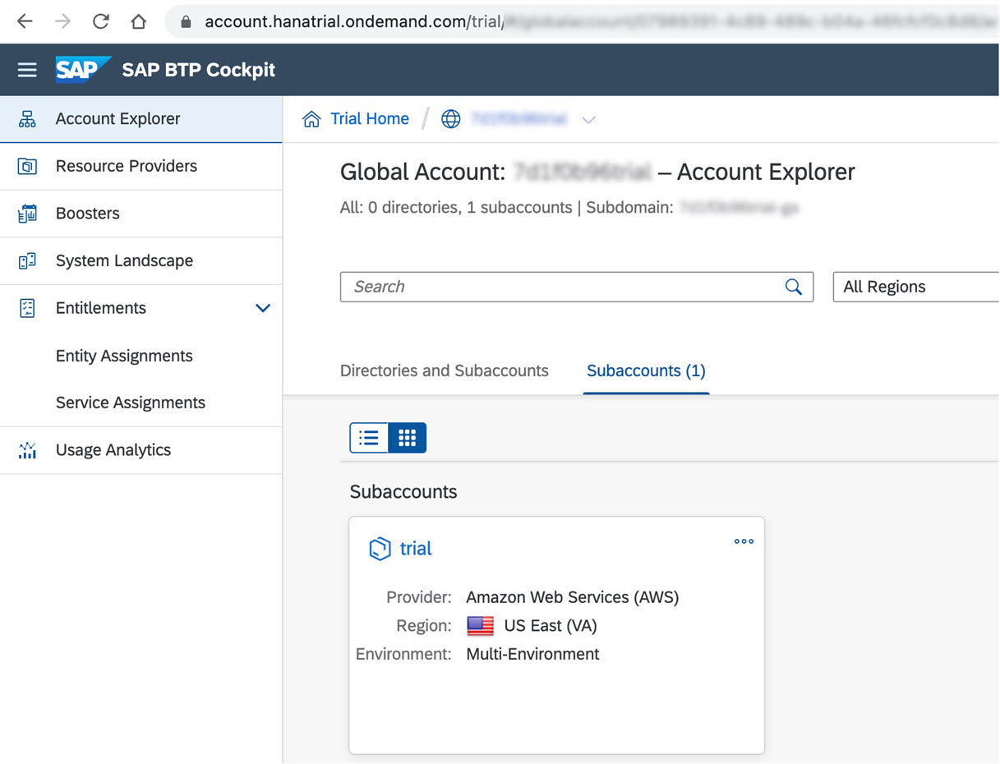

# Unit 1.2 SAP BTP Basics and Setup

This exercise is part of the openSAP course [Build Resilient Applications on SAP BTP with Amazon Web Services](https://open.sap.com/courses/aws1), Week 1 Unit 2 - SAP BTP Basics and Setup.

The objective of the exercise is to create a SAP BTP Trial account that you can further use throughout this course and beyond. 

If you already have an SAP BTP Trial account, you don't need to create a new one or move its content to a subaccount in another region! You can then skip this whole unit.

## Step 1 - Setting up BTP Trial

In this unit, we lay the foundation for the other weeks in this course. You will create your trial account and use SAP Business Technology Platform services to build business applications.

---

1.1 Visit [www.sap.com](https://www.sap.com) and click the Log On icon in the upper-right corner.

If you already have registered, you don't need to register with sap.com, you can skip to Step 1.4.

1.2 If you don’t have an account you will see a register dialog on the left-hand side of the dialog. Fill in the required fields, and click Submit.

You will see a message that an activation link has been sent to you.

1.3 Check your emails to find the activation button **Click to activate your account**.

You will see a success message after activating your account.

1.4 After activation, or if you already have an SAP account, go to the [SAP BTP Trial page](https://account.hanatrial.ondemand.com/) and click **Log On**.

You will see a dialog to confirm the terms and conditions for the SAP BTP Trial. **Check the checkboxes** and click **Accept**. This simply adds the SAP.com registration to your login account on SAP Cloud Identity.

1.5 Enter your phone number and click **New Code** to retrieve a code. Please enter this code and click **Continue** to verify your account. After the verification, you will be logged off automatically.

1.6 Click on **Log on** to log on to your verified account.

You will see one main button on the welcome screen of the SAP BTP Cockpit. Click on **Enter Your Trial Account** to navigate to your global account.

> Bookmark the link for fast and quick access to the cockpit.

1.7 Select **Go To Your Trial Account**. 

1.8 The global trial account contains **one** subaccount and space. Navigate to the subaccount by clicking on the tile named **trial**.

> Make yourself familiar with the [basic concepts of SAP Business Technology Platform](https://developers.sap.com/tutorials/cp-trial-quick-onboarding.html) to make the most of your trial experience.

This page will display the current state of the subaccount. You can execute Boosters, add entitlements and get started with your SAP BTP development. Click on the **trial** subaccount to get into the SAP BTP Cockpit.

In the next tutorial let us set up a free tier account in AWS. [Create an AWS Free Tier Account](../Unit%201.3/README.md)