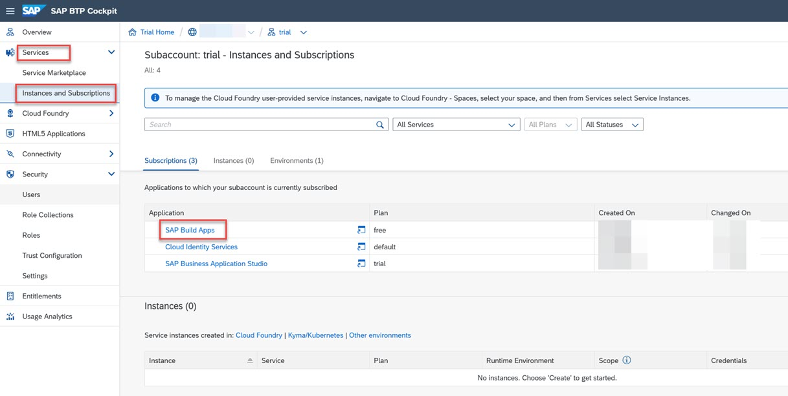
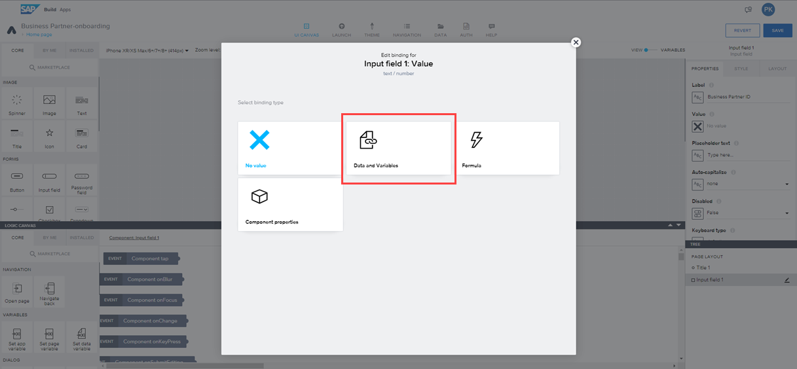
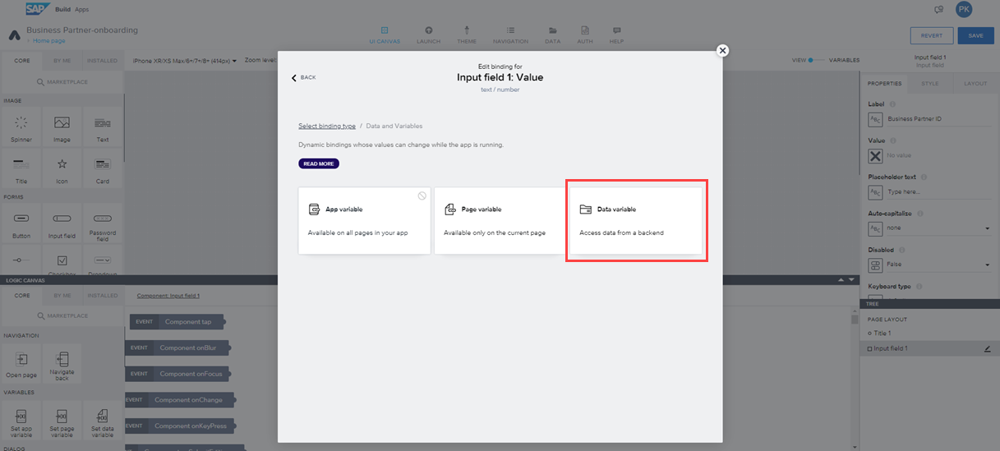
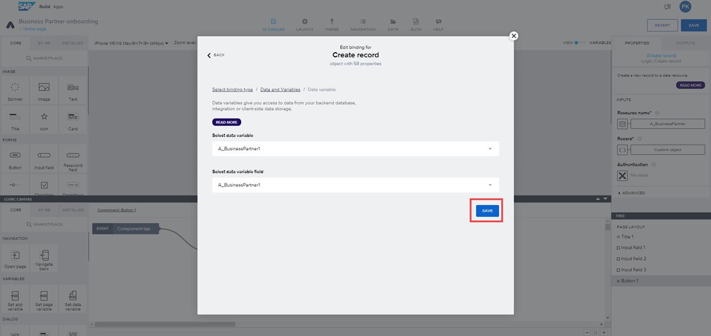

# Unit 2.2 Keep the core clean by extending SAP S/4HANA with SAP Build Apps 

Welcome to the hands-on exercises for Week 2 Unit 2.

This exercise is part of the openSAP course [Build Resilient Applications on SAP Business Technology Platform with Amazon Web Services](https://open.sap.com/courses/aws1).

The objective of this exercise is to subscribe to SAP Build Apps and create a Business partner onboarding application using SAP Build Apps.

# Section 1: Setup SAP Build Apps
The objective of this section is to subscribe to SAP BTP Services that are required for developing a Low-Code/No-Code application using **SAP Build Apps**.

Refer to [Set Up SAP Build Apps (with Booster) on SAP BTP Trial Account](https://developers.sap.com/tutorials/build-apps-trial-booster.html) to set up SAP Build Apps.

# Section 2 - Setup SAP S/4HANA or build a SAP S/4HANA Mock Service for Business Partner
You can use SAP S/4HANA Cloud or build a mock service in SAP BTP for this exercise. In this tutorial, you will build a mock service and integrate it with SAP Build Apps.
In case you want to leverage your SAP S/4HANA system, please check for the respective API URLs and destination configurations.

## 1 - Build a Simple Mock Server for Business Partner API

If you don't have access to an SAP S/4HANA system, you can use the setup mock server application by following the [Set up Mock Server](https://github.com/SAP-samples/btp-s4hana-nocode-extension/blob/main/setup/mock/README.md) guide.

**Note the below changes** in the SAP BTP trial account when following this guide. As this was published earlier, there are a few changes that need to be done that are documented below.

- Look for the command palette in SAP BAS from Menu -> View -> Command Palette as below to log in to Cloud Foundry.

- In your SAP BTP Destination configuration, ensure to append /odata/v4/op-api-business-partner-srv to the mock server URL. Your URL should look like below 
https://trialaccount-mock-srv.cfapps.us10-001.hana.ondemand.com/odata/v4/op-api-business-partner-srv

- When trying to log in to the Cloud Foundry trial account using the CF command line or Postman, the following error is displayed:

   Authenticating...
   {"error":"invalid_grant","error_description":"User authentication failed: MAIL_NOT_VERIFIED"}

   Try resetting the password of your Universal ID. Reopen BAS from SAP BTP Cockpit -> Subaccount -> Instances and Subscriptions and re-login.

# Section 3 - Create a No-Code Application with SAP Build Apps
In this section, you will create an SAP Build Apps application.

## Step 1 - Create a Project
 
1. To open **SAP Build Apps Application Development** via SAP cockpit, navigate to your SAP BTP subaccount. From the left side of your subaccount menu, navigate from **Services** -> **Instances and Subscriptions**. In the tab **Subscriptions**, click on **SAP Build Apps** to open the entry page for Application Development.

2. You might be prompted with a login screen of either default Identity Provider or custom Identity Provider depending on what you have configured.
Choose the custom identity provider.

3. Log in to the Application using your custom Identity Provider credentials.

4. On the Build, app dashboard choose to **Create** 

5. Choose the **Build an Application**

6. Choose **Web & Mobile Application**. 

7. Enter a **Project Name** as  **BusinessPartner-onboarding** enter a **Short Description** and then choose **Create**.

8. Your created project will be opened in **App Builder** which is the central page to build your application including a user interface, logic, as well as data integration.

9. Choose **Headline** and find the **Properties** tab in the menu on the right to change the content of the title. Choose **Content**.

10. Change the content from **Headline** to **Business Partner Onboarding**.

11. Find the text field in the UI canvas in the center of your screen and choose **x** to remove this component.

## Step 2 - Enable Authentication

To consume data from your SAP backend system or mock data that is configured as an SAP BTP destination in the previous section, you need to enable authentication.

1. Choose **AUTH** at the top section of the app builder.

2. Choose **Enable Authentication**.

3. Select **SAP BTP Authentication**.

4. Choose **OK**. This enables authentication for the project.

## Step 3 - Add a Data Source

To add a data source, you need to add the following steps to your project.

1. Choose the tab **Data** at the top of the App builder.

2. Find the section **No systems integrated** and choose **Add Integration**.

3. On the next screen **SAP Systems**, choose **BTP Destinations**.

4. Select the destination (**bupa**) that you have created in the previous section from the list.

5. Under the **Data entities**, select **Search**, enter **A_BusinessPartner** and then choose **Install Integration**.

6. After installing integration, you'll see **Enable Data Entity**. Select **Enable Data Entity** to enable it.

7. Now, search for **A_BusinessPartnerAddress** and choose **Enable Data Entity**.

8. Choose **Save** at the top of the app builder. This adds the data source to your project. Choose the tab **UI Canvas** to go back to the UI designer view.

## Step 4 - Create Variables

1. Switch to the **Variables** view by selecting **variables**

2. Choose **Data Variables** and then choose **ADD Data VARIABLE**

3. choose **A_BusinessPartner**

4. It creates the data variable **A_BusinessPartner1**. Choose this variable and then select **New data record" in the right side panel. 

5. We will make the Business Partner that we are creating in the blocked state and we will discuss how to unblock it in the subsequent units.
Choose **Show logic for HOME PAGE** 

6. Choose **Set data variable** in the bottom panel and then choose **Custom object** in the right side panel.

7. Scroll down in the **Edit binding** pop-up and then choose the **X** button below the **BusinessPartnerIsBlocked** field.

8. Choose **Static true/false** in the bottom panel and then choose **Custom object** in the right side panel.

9. Scroll down to the **BusinessPartnerIsBlocked** field and then select **True**.

10. Scroll down and then click on **Save** to save the changes to the **Data Variable**.

11. Switch back to the **View** tab by clicking on the **View** button.

12. Click on **Save** to save the changes.

## Step 5 - Create the Business Partner Form

1. On the left panel of UI CANVAS, you can see the **CORE** tab, choose the **Input field** and then drag the **Input field** and drop to the application's page.

2. On the right side **PROPERTIES** section, in the **Label** field, enter the value as "Business Partner ID".

3. Choose the button below the **Value** field 

4. In the Pop-up, choose **Data and Variables**

5. Choose **Data variable**

6. Choose **A_BusinessPartner1**

7. Scroll down and click on **BusinessPartner**

8. Choose **Save** to save the binding.

9. Follow the above steps 1 to 8, to create another input field "First Name" and bind it to the **FirstName** of the **A_BusinessPartner1** variable.

10. Follow the above steps 1 to 8, to create another input field "Last Name" and bind it to the **LastName** of the **A_BusinessPartner1** variable.

11. Drag the **Button** to the application's page and then change the **Label** to **Create**.

12. Choose the **Create** button and add logic for the **Create** button in the **LOGIC CANVAS**.

## Step 6 - Add logic to the Submit button

1. In the **LOGIC CANVAS**, in the left panel **CORE** tab, scroll down and drag **Create Record** to the logic panel.

2. Connect the output of the **Component tap** to the input of **Create Record**.

3. Choose **Create Record** and in the right side panel, in the **Resource name** field, choose **A_BusinessPartner**

4. Choose the button below the **Record** field.

5. In the pop-up, choose **Data and Variables**, then choose **Data Variable** and then click on **A_BusinessPartner1** under **Select Data variable**.

6. Under **Select data variable field** click on **A_BusinessPartner1**

7. Choose **Save** to bind the data variable.

8. Drag the **Alert** dialog to the logic panel.

9. Enter the **Dialog title** as **Business Partner created successfully**.

10. Create another alert dialog by following the above steps 8 and 9 and enter the **Dialog title** as **Business Partner creation failed**.

11. Connect the Success output of **Create Record** to the input of the **Business Partner Created successfully** dialog and connect the Error output of **Create Record** to the input of the **Business Partner Creation failed** dialog.

12. Use **Show Spinner** control to display the spinner while the application is fetching the response from the backend and use **Hide Spinner** to hide the spinner once the response is received from the backend API.

13. Click on **Save** to save the application.

You have successfully created the Business Partner Onboarding application.

## Step 7 - Testing the application
1. Choose the tab **Launch** at the top of App Builder.

2. Choose the **Open Preview portal** to open the application.

3. It opens a new browser tab. Choose **Open Web Preview** in this new tab.

4. Click **Open** in the **Business Partner-onboarding** app tile.

5. It opens the application preview.

6. Enter the **Business Partner ID** (String with maximum 10 characters since it is defined in mock server with this restriction), **First Name** and **Last Name** and then click on **Create**.

7. If the business partner is created, it displays the **Business Partner created successfully** message in the popup.

You have successfully tested the application.

# (Further Steps - Optional) - Deploying the application to SAP BTP and integrating the application with SAP Build Work Zone, standard edition

1. Follow [Build and Deploy Your SAP Build Apps Application to [SAP BTP](https://github.com/SAP-samples/btp-s4hana-nocode-extension/blob/main/create-application/deploy/README.md) GitHub link to build and deploy the application to SAP BTP.

2. Follow [Integrate the Application with SAP Build Work Zone, standard edition](https://github.com/SAP-samples/btp-s4hana-nocode-extension/blob/main/create-application/workzone/README.md) to integrate the application with SAP Build Work Zone, standard edition

In the next unit, you will setup AWS services and will enhance this application by connecting this to AWS Services.
[Connect SAP Build Apps with AWS Services](../Unit%202.3/README.md)
