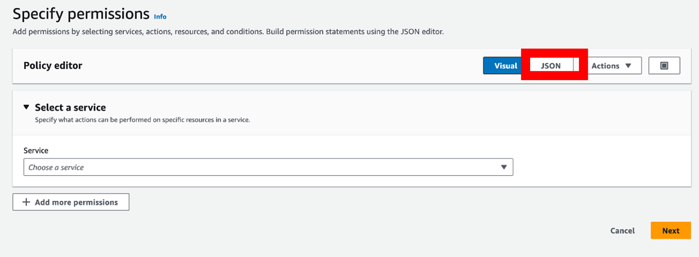
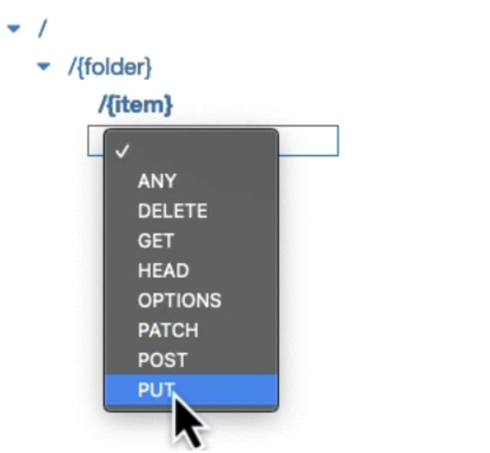
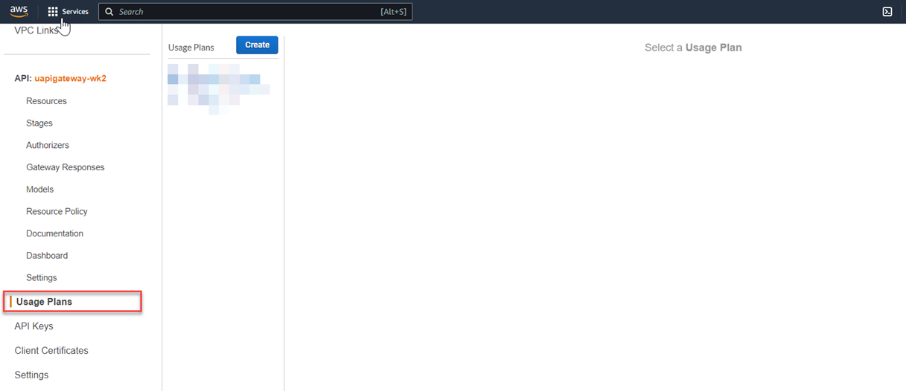
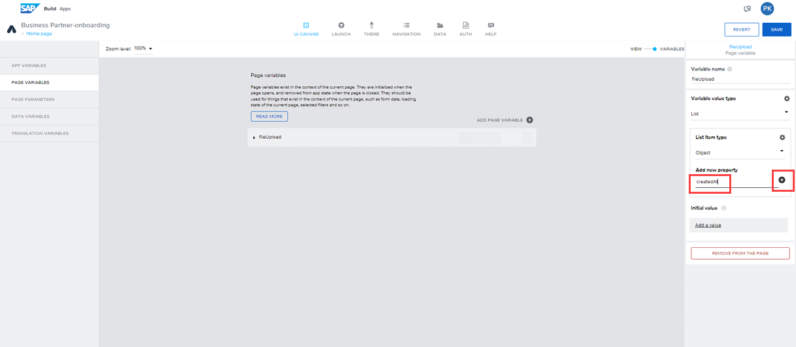
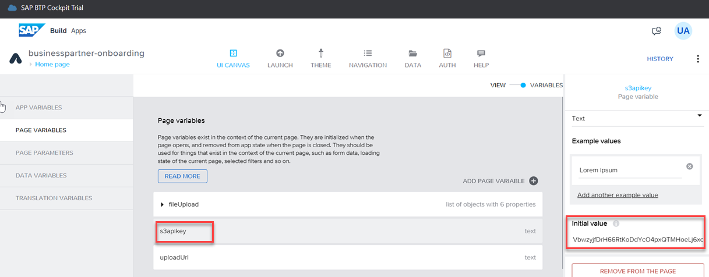
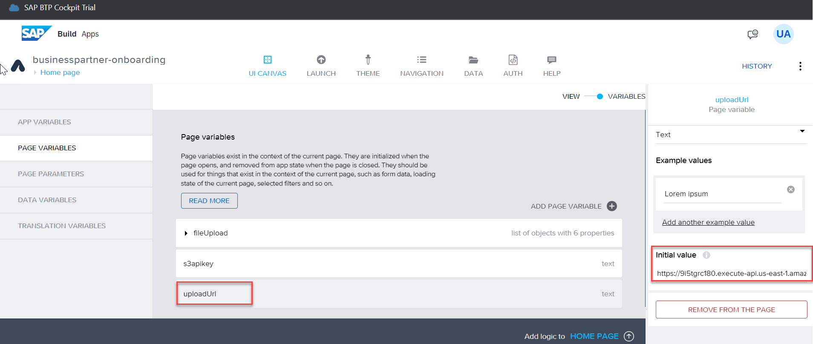

# Unit 2.3 Connect SAP Build Apps with AWS services 

Welcome to the hands-on exercises for Week 2 Unit 3.
This exercise is part of the openSAP course [Build Resilient Applications on SAP Business Technology Platform with Amazon Web Services](https://open.sap.com/courses/aws1).
The objective of this exercise is to create an API in Amazon API Gateway to store and retrieve documents from an Amazon S3 bucket.

## Prerequisites
You have created an AWS Free Tier account: [AWS Free Tier](https://aws.amazon.com/free/)

## Section 1: Create an Amazon S3 Bucket
The objective of this section is to create an Amazon S3 bucket to store and retrieve documents. 

<details>

1.	Log on to your [AWS Account](https://console.aws.amazon.com/)

2.	Search for S3 on the search bar or access directly via this [link](https://s3.console.aws.amazon.com/s3/home)

    

3.	Click on **Create Bucket**

    

4.	Enter your bucket name and select a region.
    Your bucket name needs to be unique. 
    Leave the rest of the settings with their default values.
    Note down the bucket name and region.

    

5.	Scroll to the end and select Create Bucket
   
    

    Your bucket is created, you can see the success message and the bucket in the list.

</details>

## Section 2: Create IAM Role & Policy

This section describes how to create an IAM Role and Policy that will enable our API to access the Amazon S3 Bucket we recently created to store and retrieve documents. 

<details>

1.	Access the IAM Console by searching or clicking on this [link](https://console.aws.amazon.com/iamv2)

    

2. Access the IAM Policies list by clicking on the left menu or the number in the middle of the page

    

3. Click **Create policy**

    

4. Select **JSON**

    


5.	Enter the **JSON Policy** from the snippet below and click **Next**
    Make sure you replace <your_bucket> with the name of the bucket you created in the previous section
   
    
    ```
    {
        "Version": "2012-10-17",
        "Statement": [
            {
                "Effect": "Allow",
                "Action": [
                    "s3:PutObject",
                    "s3:GetObject"
                ],
                "Resource": "arn:aws:s3:::<your_bucket>/*"
            }
        ]
    }

    ```
6.	Enter the **Policy name** and click **Create policy**
    
    

7.	Access the IAM Roles list by clicking on the left menu 

    

8.	Click **Create role**
    
    

9.	Select **Custom trust policy**
    
    

10.	Insert the **custom trust policy** from the code snippet below and click **Next**
    
    
    
    ```
    {
        "Version": "2012-10-17",
        "Statement": [
            {
            "Sid": "",
            "Effect": "Allow",
            "Principal": {
                "Service": "apigateway.amazonaws.com"
            },
            "Action": "sts:AssumeRole"
            }
        ]
    } 
    ```


11.	Select the Policy created previously.

    Search for the policy by the name, select the policy with the checkbox and click **Next**

    


12.	Provide a **Role name**, scroll down to the end and click **Create role** 

    

    Your role has now been created and it is ready to be utilized.

    

13.	Click on your role name to copy the resource name (ARN) to be utilized in the next section

    
    
    Keep the ARN handy for the next section. 


</details>

## Section 3: Create API in Amazon API Gateway

This section describes the steps required to create your API in Amazon API Gateway to store and retrieve documents from Amazon S3. 


**Note:** Please use the old console until we update the documentation with the new console for Amazon API Gateway.

<details>

1.	Access Amazon API Gateway by searching for the service or this [link](https://console.aws.amazon.com/apigateway/main/apis)

    

2.	 Click **Create API** and then select **REST API - Build**.

     

3.	Select **New API**, enter your **API name** and leave **Endpoint Type = Regional**.

    

4.	Create Resource **{folder}**.  
    Ensure you enter **{folder}** for the **Resource Name** and **Resource Path** field.  


    
    

5.	Create resource **{item}** under {folder}. Ensure you enter **{item}** for both the **Resource Name** and **Resource Path** field. 

    
    

6.	Create method **PUT** under {item}
    Ensure **{item}** is selected

    

7.	Select **PUT** and click on the refresh button next to it to view the form.
    
    

8.	Update with the following information. Leave the rest as default/blank.

    ```
    Integration type: AWS Service
    AWS Region: your region
    AWS Service: Simple Storage Service (S3)
    HTTP Method: PUT
    Action Type: Use path override
    Path override: {bucket}/{object}
    Execution Role: resource name for the role created in the previous section.
    ```
    

9.	In the next screen select **Integration Request**.
    We need to map the path (bucket/object) to the resources we created (folder/item)
    
    
    
10.	Expand URL Path Parameters and select Add path.
    
    
    
11.	Enter the following mappings

    ```
    Name: bucket - Mapped from: method.request.path.folder 
    Name: object – Mapped from: method.request.path.item
    ```

    

    Make sure you click on the tick after entering the second line:

    

12.	Go back by selecting Method Execution at the top and select **Create Method**, to define the **GET** method under **/{item}**.

    

13.	Use the same settings from the PUT method, except for the HTTP method (GET in this case)

    ```
        Integration type: AWS Service
        AWS Region: your region
        AWS Service: Simple Storage Service (S3)
        HTTP Method: GET
        Action Type: Use path override
        Path override: {bucket}/{object}
        Execution Role: resource name for the role created in the previous section.
    ```

    

14.	Enter the URL Path Parameters (same parameters used for the PUT Method)
    

15.	Click on Method Execution to go back
    

16. Enable **CORS**

    From the actions menu, select **Enable CORS**

    


    Ensure both PUT and GET methods are selected. Click on **Enable CORS and replace existing CORS headers**
    
    
    
    
    Please note that when enabling CORS, the Method Response and Integration Responses will be updated and an entry for Access-Control-Allow-Origin added. No action is required but you will notice this as an additional value.

17.	Click on Settings on the left side to configure the Binary Media Types supported.
    

18.	Scroll down, click on **Add Binary Media Type** and enter **application/pdf**

    This will configure binary support for PDF files.

     
    
    Click on **Save Changes**. 

19.	Enable security by requesting an API Key for the PUT method. Navigate back to the PUT Method by clicking on Resources and choose PUT

    

20.	Select Method Request

    

21.	Click the pencil next to API Key Required and change from false to true.

    This will require an API Key to be provided to call the API. 

    
    Click on Method Execution to go back

22.	Deploy API

    

23.	Create a New Stage, enter a Stage name, Stage description and Deployment description and click Deploy

    

24.	Leave all settings with their default values and click Save Changes
    
    

    You will find the URL for your API at the top of this page, under Invoke URL. Note down this Invoke URL.

25.	Next, you need to create a Usage Plan. Select the setting from the menu on the left

    

26.	Enter a Name and untick Enable throttling and Enable quota.

    

27.	Associate the Usage Plan with the Stage you just deployed
    
    

28.	Create an API Key to be able to authenticate and call the PUT method

    You can create the API Key directly from this screen and associate it with the Usage Plan.

    
    

29.	Once the API Key has been created and associated with the Usage Plan, click Done
    
    

30.	Retrieve the API Key by selecting API Keys and the name of the key and **Show** 

    
    

    Keep this key handy to be utilized within SAP Build Apps. 

</details>

You have now successfully created your API to store and retrieve files from Amazon S3. 

## Section 4: Consume Amazon S3 API in SAP Build Apps application

This section describes how to consume the Amazon S3 API in the SAP Build Apps application.
<details>

### Step 1: Create required Page Variables in the SAP Build Apps application

1. Log in to SAP Build Apps and open the **Business partner-onboarding** application that you created in the previous exercise 2.2

    

2. Switch to the **VARIABLES** tab.

    

3. Choose **PAGE VARIABLES** and then click on **ADD PAGE VARIABLE**

    

4. Enter the **Variable name** as **fileUpload**, select the **Variable value type** as **List** and then select **List item type** as **Object**

    

5. In the **Add new property** field, enter the property name as **createdAt** and then click the **+** button.

    

6. Expand the **fileUpload** variable, click the **createAt** property and select **Variable value type** as **Date/time text(ISO 8601)**

    

7. Add 5 more properties to this **fileUpload** variable by repeating steps 5 and 6 above.

    Property Name | type | 
    --- | --- |
    mimeType | Text |
    modifiedAt | Date/time text(ISO 8601) |
    name | Text |
    path | Text |
    size | Number |

    The variable **fileUpload** should look like this.

    

8. Add another page variable with a name as **s3apikey** and **Variable value type** as **Text** and set the initial value as the value that you have noted from **Section 3: Step 30**.
    
    

9. Add another page variable with the name as **uploadUrl** and **Variable value type** as **Text** and Initial value as the value that you have noted as Invoke URL from **Section 3: Step 23** and append it with the bucket name that you have created.

    For example, if the invoke URL is **https://ajdgjafdaf.execute-api.eu-west-1.amazonaws.com/v1** and the bucket name **test-bucket01**, then enter the Initial value
    as **https://ajdgjafdaf.execute-api.eu-west-1.amazonaws.com/v1/test-bucket01/**


    

10. Switch back to the **VIEW** tab.

    

### Step 2: Add components to the SAP Build Apps application

1. Drag and drop the **Button** name it as **Select Document** and change the **STYLE** to **Secondary Button**.

    

2. Click on the **Select Document** button and then Click on **Add logic to BUTTON 2**

    

3. Click on the **MARKETPLACE** in the LOGIC CANVAS

    

4. Search for "pick files" and then choose **Pick files** from the search results

    

5. Install this component by clicking the **Install** button.

    

6. Install another component by name **Upload files** by following steps 3,4 and 5 above. Select the one with the description "Upload file(s) to the given URL(s)".

    

7. Drag and drop the **Pick files** component to the LOGIC CANVAS and then connect it to the Component tap.

    

8. Drag and drop the **Set page variable** component to the LOGIC CANVAS and then connect it to the success output of the **Pick files** component.

    

9. Click on the button under the **Assigned Value** field.

    

10. Click on the button **Output value of another node** in the popup.

    

11. Choose **Pick files** under **Select logic node**

    

12. Choose **Files** under **Select node output**

    

13. Choose **Save** to save the binding.

    

14. Click on the **Create** button in the **Business Partner Onboarding** form and then drag and drop the **Upload files** component to the **LOGIC CANVAS**

    

15. Connect **Create record** success output to **Upload files** input and connect **Upload files** success output to success alert and connect **Upload files** failure output to failure alert respectively.

    

16. Click on **Upload files** and then in the **PROPERTIES** tab on the right-hand side, click the binding button as shown below.

    

17. Enter the formula as **[SET_KEY(pageVars.fileUpload[0], "uploadUrl", pageVars.uploadUrl+ data.A_BusinessPartner1.BusinessPartner+".pdf")]** and then choose to **Save** the binding.

    

18. Click on the **Headers** under the **OPTIONAL INPUTS**

    

19. In the pop-up, enter the Formula as **{"Content-Type":"application/pdf","x-api-key":pageVars.s3apikey}** and then choose **Save**.

    

20. Save the application by clicking on the **Save** button.

    

</details>

## Section 5: Testing the application

<details>

1. Choose the tab **Launch** at the top of App Builder.

    

2. Choose the **Open Preview portal** button to open the application.

    

3. It opens a new browser tab. Choose **Open Web Preview** in this new tab.

    

4. Click on the **Open** button in the **Business Partner-onboarding** app tile.

    

5. It opens the application preview.

    

6. Enter the **Business Partner ID**, **First Name** and **Last Name**, click on **Select Document**, choose the supporting document (pdf) and then click on **Create**.

    

7. If the business partner is created, it displays the **Business Partner created successfully** message in the popup.

    

You can also log in to AWS console, navigate to the Amazon S3 bucket and verify that the pdf file with the name as business partner ID is created.

</details>

You have successfully tested the application. In the next unit, you will enhance this application with a simple approval process in the SAP Build Process Automation scenario.
[Build a simple approval scenario in the SAP Build Process Automation](../Unit%202.4/README.md)


