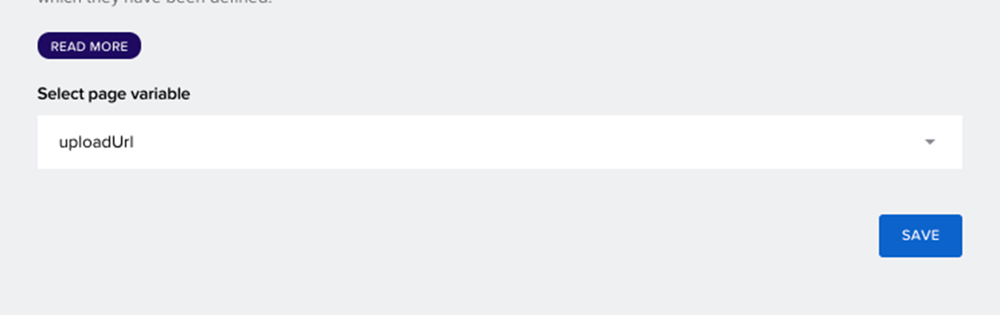

# Unit 2.4  Enhance your business processes with SAP Build Process Automation

This exercise is part of the openSAP course [Build Resilient Applications on SAP BTP with Amazon Web Services](https://open.sap.com/courses/aws1) - there you will find more information and context for Week 2 on SAP Build. The objective of this exercise is to create an approval process/workflow using SAP Build Process Automation and call the Business Partner OnBoarding application that was built in the earlier unit.

## Section 1: Subscribe to SAP Build Process Automation
The objective of this section is to subscribe to the SAP Build Process Automation. 

1. Log on to your SAP BTP cockpit. Navigate to the **Instance and Subscriptions** page and subscribe to the **SAP Build Process Automation**.

    

2. Navigate to "Users". Open your user and assign the respective role collections as shown in the below screenshot.

    

## Section 2: Create the Actions Project and Business Process/Workflow
In this section, you will create an Actions Project to Read and Unblock the business partner. Then you will create the workflow/Business Process to unblock the business partner.

1. Open SAP BTP Cockpit. Navigate to the **Instance and Subscriptions** page open the "SAP Build Process Automation" subscription and click "Go to Application".

    

2. Click on "Create" to create a new Actions Project in the Build Lobby.

3. Click the tile "Build an Automated Process".

    

4. Click the "Actions" tile.

    

5. Click "Upload API Specification". Select the metadata file of the business partner.

    
   
    > Note: To download the metadata document, add /$metadata to the Business Partner OData service and save it to a local folder.

6. Provide "Project Name" and "Description". Click "Create".

    

7. Select "Get" and "Patch" requests. You use "Get" to read the Business Partner and "Patch" to update the business partner with "Unblocked" status.

    

8. Click Read Business Partner and update the description. Click "Update".

    

9. Click Patch Business Partner and update the description. Click "Update".

    

10. Search for the "BusinessPartnerIsBlocked" field and select "Static". Enter "false" in the value field.

    

11. Click "Save". Click "Release".

    

12. Click "Publish to Library".

    

13. Go back to the Build Lobby. Choose to **Create** to create the "Business Process".

14. Click the "Business Process" title.

    

15. Provide "Project Name" and "Description". Click "Create"

    

16. Enter the Process (Workflow) Name and Description. Click "Create".

    

17. Go to "Variables" and click "Configure" to define the workflow/process Inputs.

    
    > Note: If you are not able to see this, click on the empty canvas.

18. Enter the "BusinessPartner" and "SupportingDocument" inputs.

    

19. Click on the "+" icon and click "Actions -> Browse Library" to add the Read business partner action.

    

20. Click "Add" on the **Read Business Partner* action tile.

    

21. Click the newly added "Read Business Partner" action. 

22. Click the "Inputs" tab. 

23. Click "BusinessPartner" and select the Business Partner for the "ProcessInputs".

    

26. Click the "General" tab and Click "Create Destination Variable".

    

27. Provide value for Identifier and click "Create".

    

28. Click the "+" icon after the "Read Business Partner" action. Create a "New Approval Form".

    

29. Provide Name and Description. Click "Create".

    

30. Enter the "Subject" and your email id in "Users".

    

31. Click on the three-dot button on the "Approval Form" and click "Open Editor".

    

32. Drag and Drop the Heading (H2) onto the Approval Form and provide a heading "Business Partner Approval".

    

33. Drag and Drop three "Texts" on the Approval form.

    

34. Select "Read Only" for all three of them.

    

35. Drag and Drop a "Link".

    

36. Provide a "Link Text". Click "Save". Your form should look like below:

    

37. Go back to the "Approval Process/Workflow" and click "Approval Form". Click "Inputs" and select the "Business Partner", "First Name" & "Last Name" from the "Read Business Partner" Action output.

    

38. Click "Link" and select "SupportingDocument" from the Process Inputs.

    

39. Click the "+" icon at Reject Node, to drag it to the "End" process.

    

40. After connecting the Reject node to the End Process, it should look like below:

    

41. Click the "+" icon at Approve Node and click "Browse Library".

    

42. Select the "Unlock Business Partner" action and select the earlier created destination variable.

    

43. Click the "Inputs" tab and select "Business Partner" from the "Read Business Partner" action.

    

44. Click on the first step (Trigger). Click "API->New API Trigger".

    

45. Provide the name.

    

46. Click "Save". Click "Release".

    

46. Before deploying, you need to configure the destination. Open SAP BTP Cockpit. Go to destinations open BUPA destination and click edit. Then add the additional property "sap.processautomation.enabled" with the value "true". Then click "Save".

    

46. Go back to the SAP Build "Settings" tab. Go to "Destinations" and choose "New Destination". Now you can choose the Business Partner destination and click "Add".

     

47. Come back to the Business Partner Approval Process. Click "Deploy".

    

48. Click Next and select "Runtime Variables". Here select the destination that you added in the previous steps.

    

49. Open the "Monitor" page and Open "Triggers".

    

50. Click "View" to open the trigger.

    

51. Copy this information, which you will use to trigger from the SAP Build Application (Business Partner Onboarding app).

    

## Section 3: Call the Workflow from Business Partner OnBoarding App
You will now integrate this workflow into the Business Partner OnBoarding Application that you developed in the earlier unit.

1. Create the destination for SAP Build Process Automation, which you will use to trigger the workflow from the SAP Build App (Business Partner Onboarding Application). Follow the steps in this tutorial - [Create Destination to Trigger Process from any Service](https://developers.sap.com/tutorials/spa-create-service-instance-destination.html). 

    

2. Navigate to the SAP Build Apps project (Business Partner Onboarding App). Go to the "Data" tab and create "SAP BTP Destination REST API Integration".

    

3. Enter the Data entity name.

    

4. Click "Add New" in the resource schema and add the structure as per the schema you copied from the trigger.

    

    

    

5. At the end, the schema should look like below.

    

6. Select the "create" action and click "Request headers".

    

7. Click "List of values"

    

8. Enter the Header name and Header value as shown below and click "SAVE".

    

9. Again, click "Request body mapper" in the create action. Select Formula.

    

10. Click "Create formula".

    

11. Enter the formula and click save. 

    

    >**Formula**: ENCODE_JSON({"definitionId":query.record.definitionId, "context":query.record.context})

12. Select the destination that you created in Step 1.

    

13. Navigate back to "UI CANVAS", Click "Create" and Click "Add logic to BUTTON".

    

14. Drag and drop the "Create record" to the logic canvas and connect it at the end, after the Business Partner is created and the attachment is uploaded.

    
    

15. Click the newly added "Create record" and in the properties, click "Resource name".

    

16. Here select the "Business Partner Workflow" data entity that you created earlier and click SAVE.

    

17. Select the "Custom object" to pass the business partner data to the workflow.

    

18. Enter the "definitionId" that you got from the trigger. 
    

19. Click the "businesspartner" and select "Data and Variables", click "Data variable" and select  "Business Partner". Click SAVE.

    
    
    

20. For **supportingdocument** field, click "Page variable" and select "uploadUri". click "SAVE".
    
    

21. Go to the "LAUNCH" tab, open the preview portal, enter the data and click "Create".
    
    

22. Now, go to the inbox from the lobby and approve the Business Partner request.
    
    

You have successfully created an approval process using SAP Build Process Automation. In the next unit, you will enhance this application and connect Amazon SNS API to SAP Build Process Automation.
[Build a simple approval scenario in the SAP Build Process Automation](../Unit%202.5/README.md)