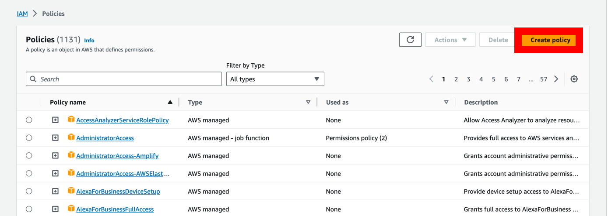
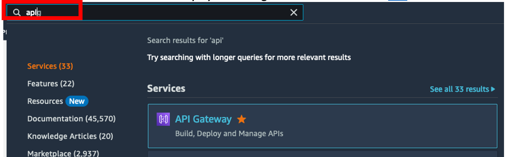

# Unit 2.5 Integrate Business Processes with AWS Services

This exercise is part of the openSAP course [Build Resilient Applications on SAP BTP with Amazon Web Services](https://open.sap.com/courses/aws1) - there you will find more information and context for Week 2 on SAP Build. The objective of this exercise is to create an API in Amazon API Gateway to store and retrieve documents from an Amazon S3 bucket.

## Prerequisites
You have created an AWS Free Tier account: [AWS Free Tier](https://aws.amazon.com/free/)

## Section 1: Create Amazon SNS Topic
The objective of this section is to create an Amazon SNS Topic to be able to send and receive notifications. 

<details>

1.	Log on to your [AWS Account](https://console.aws.amazon.com/)

2.	Search for S3 on the search bar or access directly via this [link](https://s3.console.aws.amazon.com/s3/home)
    
    

3.	Enter the topic name and click the **Next step**
    
    

4.	Leave the type as **Standard** and enter the **Display name**
    
    

5.	Scroll to the end and select **Create topic**. Leave all other settings with their default values.
    !
    [Alt text](./images/aws-4.png)

6.	**Create subscription** to receive notifications in your inbox. Also, take note of the ARN for your topic, you will need it to create the API and IAM Role
    
    

7.	Select Email as Protocol and enter your email address. Click Create subscription.
    
    

</details>

## Section 2: Create IAM Role & Policy

This section describes how to create an IAM Role and Policy that will enable our API to send notifications to the Amazon SNS Topic we recently created. 

<details>

1.	Access the IAM Console by searching or using this [link](https://console.aws.amazon.com/iamv2)

    

2. Access the IAM Policies list by clicking on the left menu or the number in the middle of the page

    

3. Click **Create policy**

    

4. Select **JSON**

    

5.	Enter the **JSON Policy** from the snippet below and click **Next**
    Make sure you replace the highlighted **Resource** ARN with the one you copied when you created the SNS topic (<your_sns_policy> in the snippet below.).

    

    ```
    {
        "Version": "2012-10-17",
        "Statement": [
            {
            "Sid": "VisualEditor0",
            "Effect": "Allow",
            "Action": "sns:Publish",
            "Resource": "<your_sns_topic_arn>"
            }
        ]
    } 
    ```

6.	Enter the **Policy name** and click **Create policy**

    

7.	Access the IAM Roles list by clicking on the left menu 

    

8.	Click **Create role**

    

9.	Select **Custom trust policy**

    

10.	Insert the **custom trust policy** from the code snippet below and click **Next**

    

    ```
    {
        "Version": "2012-10-17",
        "Statement": [
            {
            "Sid": "",
            "Effect": "Allow",
            "Principal": {
                "Service": "apigateway.amazonaws.com"
            },
            "Action": "sts:AssumeRole"
            }
        ]
    } 
    ```


 
11.	Select the Policy created previously.

    Search for the policy by the name, select the policy with the checkbox and click **Next**

    


12.	Provide a **Role name**, scroll down to the end and click **Create role**


Your role has now been created and it is ready to be utilized.


13.	Search and click on your role name to copy the **resource name (ARN)** to be utilised in the next section

    

    

 
Keep the **ARN handy** for the next section. 

</details>

## Section 3: Create API in Amazon API Gateway

This section describes the steps required to create your API in Amazon API Gateway to send notifications to the Amazon SNS Topic you created earlier.

<details>

1.	Access **Amazon API Gateway** by searching for the service or this [link](https://console.aws.amazon.com/apigateway/main/apis)

    

2.	Select **REST API - Build**

    

3.	Select **New API**, enter your **API name** and leave **Endpoint Type = Regional**. Click **Create API**

    

4.	Create **Resource sendnotification**

    
    

5.	Create method **POST** under the **sendnotification**

    

6.	Select POST

    

7.	Select/enter the following information. Leave the rest as default/blank.

    ```
    Integration type: AWS Service
    AWS Region: your region
    AWS Service: Simple Notification Service (SNS)
    HTTP Method: POST
    Action Type: Use action name
    Action: Publish
    Execution Role: resource name for the role created in the previous section.
    ```
    

8.	In the next screen select **Method Request**.

    

9.	Expand **HTTP Request Headers** and add **message, subject and topic**. These parameters will be sent in the header of the API call and need to be passed to SNS for the notification to be sent.  

    

10.	Go back to the previous screen by selecting **Method Execution** at the top of the screen. Then select **Integration Request**

    

11.	Enter **URL Query String Parameters** and map as follows

    ```
    Name: Message – Mapped from: method.request.header.message
    Name: Subject – Mapped from: method.request.header.subject
    Name: TopicARN – Mapped from: method.request.header.topic
    ```
    

12.	Click on **Method Execution** to go back and then select **Method Request** to enable security by requesting API Key

    

13.	Click the pencil next to **API Key Required** and change from **false to true**.

    This will require an API Key to be provided to call the API.

    

14.	Deploy **API**

    

15.	Create the **New Stage**, enter the **Stage name, Stage description and Deployment description** and click **Deploy**

    
16.	Leave all settings with their default values and click **Save Changes**

    

    You will find the URL for your API at the top of this page, under Invoke URL

17.	Next, you need to create a **Usage Plan**. Select the **Usage Plans option** from the menu on the left.

    > **Note**: you can reuse the previously created Usage plan from Unit 3. 
    > In that case, you just need to add the new stage to your previous Usage Plan. 

    

18.	Enter a **Name** and untick **Enable throttling** and **Enable quota**.

    

19.	Associate the Usage Plan with the Stage you just deployed.

    

20.	Create an **API Key** to be able to authenticate and call the **PUT method**

    You can create the API Key directly from this screen and associate it with the Usage Plan.

    
    

21.	Once the **API Key** has been created and associated with the **Usage Plan**, click **Done**

    
 
22.	Retrieve the **API Key** by selecting **API Keys** and the name of the key and Show 

    
    

Keep this key handy to be utilized within **SAP** Build Apps**. 

You have now successfully created your API to store and retrieve files from Amazon S3. 

</details>

## Section 4: Connect SNS API to SAP Build Process Automation process
This section describes the steps required to connect the SNS API to the SAP Build Process Automation workflow. First, the SNS API metadata is downloaded to a local folder, then a destination is created in the SAP BTP cockpit to connect with the SNS API, then an actions project is created to connect the SNS API with the SAP Build Process Automation project. In the end, this action is added to the workflow.

<details>

1.	Open Amazon API Gateway. Open the SNS API, go to 'Stages' and click "JSON" to download the OpenAPI file. Save the Invoke URL, which will be used in the creation of the destination.

    

2.  Open SAP BTP Cockpit. Navigate to the "Destinations" tab and create a destination with the below shown details.

    

    | Property | Value |  |  |  |  
    |---|---|---|---|---|
    | Name | Destination Name |  |  |  |
    | Type | HTTP |  |  |  |  
    | Description | Description |  |  |  |
    | URL | URL You Saved In Last Step |  |  |  |
    | Authentication | NoAuthentication |  |  |  |
    | sap.applicationdevelopment.actions.enabled | true |  |  |  |
    | sap.processautomation.enabled | true |  |  |  | 
    | URL.headers.x-api-key | API Key You store in the last section |  |  |  |  
    |  |  |  |  |  |  

3.  Open the Destinations in SAP Build Settings. Click New Destination and select the destination that we created in the earlier step. Click Add to save.

    
    

4.  Open SAP Build Lobby. Click Create, select "Build an Automated Process" and select "Actions".

    
    

5.  Click "Upload API Specification" and select the OpenAPI document that you have downloaded in previous steps.

    
    
    

6.  Give the name to the Action Project. Click Create.

    

7.  Select the default "sendnotification" action and click "Add".

    

8.  Click the "topic" parameter, select it as "Static" and enter the SNS topic in the "Value" field.

    

9.  Click the "subject" parameter, select it as "Static" and enter the notification subject as shown below:

    

10. Click, save, release and publish the library.

    

    

    

11. Open the Business Partner Approval Process that you have created in the previous Unit and click the "+" icon after the "Ublock Business Partner" action. Select "Browse Library" and add the SNS action action.

    

    

    

12. In the General section, create a Destination Variable and select it.

    

13. Select the "BusinessPartner" as the notification message.

    

14. Release and Deploy the project. Select the appropriate Destinations in the Destination Variable.
    

    
    
    

</details>

Now you have successfully integrated the Amazon SNS into SAP Build Process Automation using the SAP Build Action project. If you test the business partner onboarding application, you will get a notification after the business partner is unblocked.