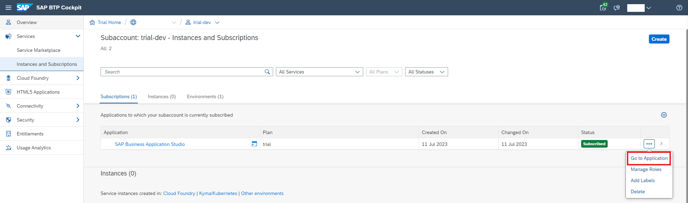
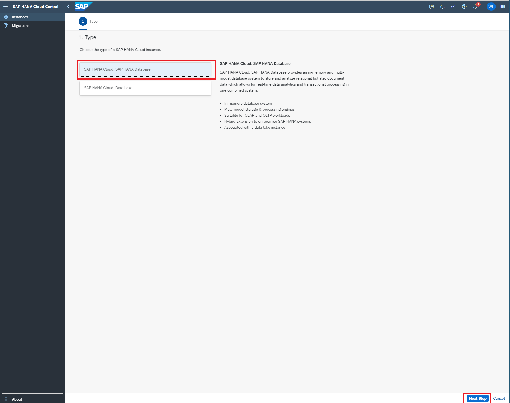

# Unit 3.2 Setting Up SAP BTP and AWS

This exercise is part of the openSAP course [Build Resilient Applications on SAP BTP with Amazon Web Services](https://open.sap.com/courses/aws1), Week 3 Unit 2 - Setting up SAP BTP and AWS.

The **objective** of this exercise is to set up your own SAP Business Technology Platform (BTP) trial account and make the trial account ready for Full Stack Business Application development. After finishing this exercise, you will successfully achieve the objectives below
  - Create your own SAP BTP Trial account
  - Subscribes to the SAP Business Application Studio service
  - Creates SAP HANA DataBase in the SAP HANA Cloud service instance
  - Subscribes to the SAP Build Work Zone service

## Step 1 - Get a Free Account on the SAP BTP Trial Account

Please follow the instructions [Get a Free Account on SAP BTP Trial](https://developers.sap.com/tutorials/hcp-create-trial-account.html) to set up your own SAP BTP trial account.

In case you are using your enterprise account, please follow the steps to check if you have all the entitlements enabled with the configurations required.

## Step 2 - Setup SAP Business Application Studio

**2.1** Login to the SAP BTP Subaccount used in  Week 2. Click the **Entitlements** -> **Add** Service Plan** button.

Note: In the case of the SAP BTP trial account, these entitlements are already added.

**2.2** In the pop-up screen, search **Business Application Studio**, select **SAP Business Application Studio** from the search result, check the **trial (Application)** checkbox, then click the **Add 1 Service Plan** button. Finally, click the Alt text button to save the service entitlement update.

**2.3** Go back to your SAP BTP Trial account, select Instances and Subscriptions, and click the Create button.

**2.4** In the **New Instance or Subscription** pop-up window, select **SAP Business Application Studio**, **trial plan**. Then click the **Create** button to create a subscription to the SAP Business Application Studio service.

**2.5** Once the subscription creation is done, let's assign the role-collection to ourself so that we could have the access to the Business Application Studio service. Go to the **Security -> Users** page from the left side-menu, and select your user showing up in the table with the **Default identity provider assignment**.

**2.6** Click the **Assign Role Collection** button. In the **Assign Role Collection** pop-up screen, search Launchpad_Admin, then check the **Business_Application_Studio_Administrator** and **Business_Application_Studio_Developer** from the search result, and click the **Assign Role Collection** button to add the role collection to your-self.

**2.7** Go to the **Instances and Subscriptions** page, click the **...** button and select **Go to Application** button in the drop-down menu of the Business Application Studio service subscription, to go to the SAP Business Application Studio main page.

**2.8** Click the **Create Dev Space** button to create an dev space in the SAP Business Application Studio service.

**2.9** In the **Create a New Dev Space** page, **give a proper, ready friendly name for your own dev space**, then click the **Full Stack Cloud Application**. Leave the extension selection as what it is, then click the **Create Dev Space button** to create a new space for full stack cloud application development.

**2.10** Congratulations, now we are ready to use the SAP Business Application Studio for full stack cloud application development. Cheers!

## Step 3 - Create SAP HANA Database in the SAP HANA Cloud Service

In this step, we will focus on create a SAP HANA Database, which will be used as the persistence database for the full stack application we will developing in this week, inside of the SAP HANA Cloud service.

---
**3.1** Go back to your SAP BTP trial subaccount main page. **Go to Overview** -> **Entitlement** -> **Configure Entitlements**.

Note: In case of trial account, all of these will be checked by default. 

**3.2** Click **Add Service Plans button**. In the pop-up screen, search **SAP HANA**. In the search result click on the **SAP HANA Cloud**, then select **tools (Application)**, **hana-cloud-connection**, and **hana** plans. 

**3.3** Select **SAP HANA Schemas & HDI Containers**, select **all** the available **service plans**, then click the **Add 7 Service Plans** button.

**3.4** Click the **Save** button to save the service entitlements changes in your SAP BTP Trial subaccount.

**3.5** Go to **Overview** page, and then go into the space in your SAP BTP trial account.

**3.6** Click the **SAP HANA Cloud** on the left side menu, click the **Create** button, and select the **SAP HANA database** from the dropdown menu.

**3.7** Select **Sign in with default identity provider**

**3.8** Now you are in the **SAP HANA Cloud Central** page. Lets create our first SAP HANA Database instance now. Click the **Create Instance** button on the upper-right corner.

**3.9** Choose **Type** as **SAP HANA Cloud, SAP HANA Database**, then click the **Next Step** button on the lower-right corner. 

**3.10** In the General page, give a proper, read-friendly name as your SAP HANA Cloud service instance's name. Providing an valid **Administrator Password**, **note down the Administrator Name & Administrator Password**. Then click the **Next Step** button on the lower-right corner.

**3.11**  **Directly click the Next Step button in the next two pages**.

**3.12** In the **SAP HANA Database Advanced Settings** page, choose **Allow all IP addresses** for the **connection**, then click the **Review and Create** button on the lower-right corner.

**3.13** Review the configuration of the SAP HANA Database, if everything looks good for you, click **Create Instance** to create the SAP HANA Database instance. 

**3.14** The SAP HANA Database creation will take sometimes, after the creation process complete, you will see that your newly created SAP HANA Database is in the **Running** status.

## Step 4 - Setup SAP Build Work Zone

In this step, we will focus on setup the SAP Build Work Zone service in your SAP BTP trial account. The SAP Build Work Zone service provides business users a central point of access for apps and tasks, with seamless integration to various UI technologies and third-party apps.

For more information of the SAP Build Work Zone service, check it out [here](https://discovery-center.cloud.sap/serviceCatalog/sap-build-work-zone-standard-edition?region=all).

---
**4.1** Go back to your SAP BTP subaccount main page. **Go to Overview** -> **Entitlement** -> **Configure Entitlements**.

Note: In case of SAP BTP trial account, these entitlements are already added. You can skip till 4.5 and continue from 4.6 onwards.

**4.2** Click **Add Service Plans button**. In the pop-up screen, search **SAP Build Work Zone**. In the search result click on the **SAP Build Work Zone, standard edition** and **standard** plans. Click **Add 2 Service Plans** to save the changes. 

**4.3** Click the **Save** button to add the SAP Build Work Zone service entitlement to your SAP BTP trial subaccount.

**4.4** Go to the **Instances and Subscriptions** page in the SAP BTP trial subaccount, then click the **Create** button on the upper-right corner.

**4.5** In the **New Instance or Subscription** pop-up window, select **SAP Build Work Zone, standard edition**, **standard Subscription**. Then click **Create** button to create subscription of the SAP Build Work Zone service.

**4.6** Once the SAP Build Work Zone service subscription creation is done, it is the time for us to assign the **Role Collections** of the SAP Build WorkZone to ourself, so that we could have the access to the SAP Build Work Zone service management console. 

Go to the **Security** -> **Users** page from the left menu, and **select your user** showing up in the table with the **Default identity provider** assignment. 

**4.7** Click the **Assign Role Collection** button. In the **Assign Role Collection** pop-up screen, search **Launchpad_Admin**, then check the **Launchpad_Admin** from the search result, and click the **Assign Role Collection** button to add the role collection to your-self.

**4.8** Now let's verify if we have the access to the SAP Build Work Zone service management console. 

Go to the **Instances and Subscriptions** page, and then **click** the **Go to Application** button of the **SAP Build Work Zone, standard edition** service subscription. **Select the Default Identity Provider to sign in.** 

**4.9** We should see the **Site Manger - Site Directory** page after the SAP Build Work Zone service management console pop up. 

