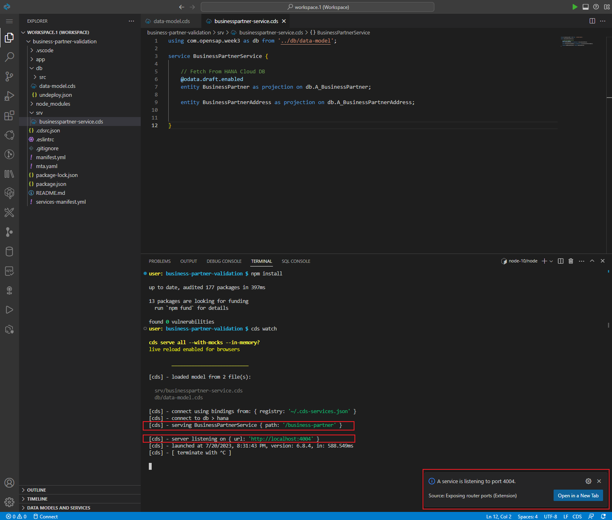
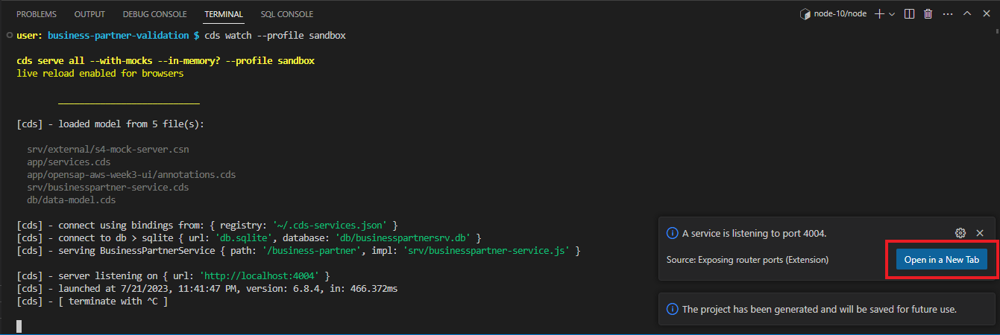
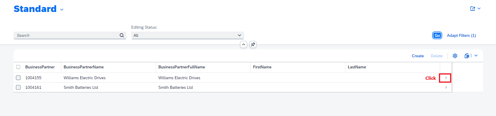
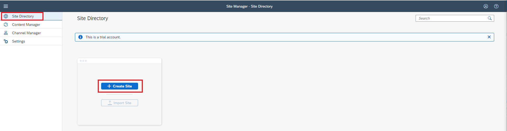

# Unit 3.3 Extend Business Process Using a CAP Application on SAP BTP

This exercise is part of the openSAP course [Build Resilient Applications on SAP BTP with Amazon Web Services](https://open.sap.com/courses/aws1), Week 3 Unit 3 - Extend a business process using a CAP application on SAP BTP.

The **objective** of this exercise focuses on how to build a business application by using SAP Cloud Application Programming (CAP) to extend the SAP S/4HANA business process. After finishing this exercise, you will successfully achieve the objectives below
  - Have a basic understanding of the SAP Cloud Application Programming (CAP) module
  - Build your first backend service by using SAP CAP for SAP S/4HANA Business Partner manipulation and validation purposes in Node.js
  - Build your first front-end application by using Fiori Element UI for SAP S/4HANA Business Partner manipulation and validation purposes.
  - Have a deep understanding of connecting backend CAP service with frontend Fiori UI.
  
You can find the complete sample code of this exercise [here](./codes).

## Overview - What You Will Build 


During this exercise, we will be guiding you to build a Full-Stack application to extend the SAP S/4HANA Business Partner validation business process. 

We will build the backend service in SAP CAP with Node.js, persist the business partner data in the SAP HANA Database hosted in the SAP HANA Cloud and build the frontend application as the entry point of the entire system with SAP Fiori Elements UI.

You can use SAP S/4HANA Cloud or build a mock service in SAP BTP for this exercise. If you have already completed exercises in unit 2.2, you can leverage the same mock service for this week's exercise as well.

As you can see from the system architecture above, there are two personas, the SAP S/4HANA Admin and Business Partner Validator. The SAP S/4HANA Admin will log in to this system via the Fiori UI and view the business partner data, which is fetched from the SAP S/4HANA Mock Server. If they find something is not right, he/she could make changes to the business partner data in the Fiori UI and save the changes after that. This updated business partner data will be persisted into the HANA DB.

Once the SAP S/4HANA Admin has completed the changes, there will be an email notification sent out to the Business Partner Validator via the Amazon Simple Notification service. The Business Partner Validator could find the business partner ID from the email and jump to the Fiori UI by clicking the URL in the email to perform the validation. If everything looks good, then the Business Partner Validator could release the business partner in the Fiori UI, which will then get updated back to the SAP S/4HANA Mock Server.

No more waiting – let's jump into the world of coding with unwavering zeal and determination.

## Good to Know Before Start

**If you'd rather not delve into the intricacies of coding, we offer an alternative method to complete this exercise. Simply follow this [instruction](./README2.md) to elegantly bypass the need for manual code creation.**

Once you've completed these steps, you'll have a fully operational Business Partner Validation application running in your SAP BTP Trial subaccount. Additionally, you'll find the entire code for this full-stack application in the Business Application Studio.

From there, you can continue your learning journey starting at Section 5, Step 4.

If time permits, we highly recommend revisiting the manual code writing documentation after using the cloned code method. This can provide a more comprehensive learning experience, helping you gain a deeper understanding of the workings of each code segment. By manually writing the code, you will better grasp the technical intricacies of SAP BTP, preparing yourself for future projects and challenges.

## Prerequisites
Please set up S4-Mock-Server application before you start this exercise. Please follow the [Setup S4-Mock-Server application guide](https://github.com/SAP-samples/btp-s4hana-nocode-extension/blob/main/setup/mock/README.md) to complete this step.

## Section 1. Create Business Partner Validation Application - Backend Service with SAP CAP in Node.js

<details>

### Step 1. Create a SAP CAP Node.js Project in the SAP Business Application Studio

In this section, we will focus on creating a Node.js CAP project in the Business Application Studio

---
**1.1** Login into your SAP BTP trial subaccount. Click the **Instance and Subscriptions** on the left menu, and then click **Go to Application** button of the SAP Business Application Studio service subscription.


**1.2** Now you will see the Dev Space we created previously is in **STOPPED** status, let us activate it by clicking the Run button 


**1.3** When it’s ready, open your dev space by clicking on the name. 


**1.4** Now you should be in the cloud IDE provided by the SAP Business Application Studio service. Let's create our Business Partner Validation Application - Backend Service based on SAP CAP by clicking the **New Project from Template** button on the Get Started page.


**1.5** The **New Project From Template** page should now have been opened. Select the **CAP Project** and then click the **Start** button on the bottom to create our CAP project for our backend service.


**1.6** Enter the **project name** as **business-partner-validation**. Select **Node.js** as **runtime**, and **select the features showing in the image below**. Then click the Finish button.


**1.7** After a while you will see that the business-partner-validation CAP project has been created for you successfully.


### Step 2. Define the Service for the CAP Project

In this section, we will focus on defining the backend service for the CAP project.

---

In the SAP CAP application, we are using [Core Data Services(CDS)](https://cap.cloud.sap/docs/cds/) to describe the Domain Models and see how domain models are consumed by using the [Service Definitions](https://cap.cloud.sap/docs/cds/cdl#service-definitions).

> Domain Models capture the static, data-related aspects of a problem domain in terms of entity-relationship models. They serve as the basis for persistence models deployed to databases as well as for service definitions.

---
**2.1** Expand the **db** folder, and create a new file **data-model.cds** by right-clicking on the db folder and choosing **New Files**...**


**2.2** Since our service will expose the Business Partner data from the S4-Mock-Server, it is better to define our Domain Model as the same as the Business Partner entity coming from S4-Mock-Server. Adding the below code to your data-model.cds file.

```node.js
namespace com.opensap.week3;

entity A_BusinessPartner{

    key BusinessPartner: String(10) not null;
    BusinessPartnerName : String;
    BusinessPartnerFullName: String;
    FirstName: String;
    LastName: String;
    BusinessPartnerIsBlocked: Boolean default false;
    verificationStatus: Association to StatusValues;
    to_BusinessPartnerAddress: Composition of many A_BusinessPartnerAddress on to_BusinessPartnerAddress.BusinessPartner = $self;
}

entity A_BusinessPartnerAddress {

    key BusinessPartner: Association to A_BusinessPartner;
    key AddressID: String(10) not null;
    StreetName: String(60);
    HouseNumber: String(10);
    PostalCode: String(10);
    CityName: String(40);
    Country: String(3);
    isModified: Boolean default false;
}

@cds.autoexpose
entity StatusValues {
  key code: String ;
    value: String;
    criticality: Integer;
    updateCode:Boolean;
}
```


**2.3** After we have defined the Domain Model, let's define the service, which will consume the Domain Model, by using the CAP CDS service definition syntax. Right-click on the **srv** folder, select **New Files...**, and give the file name as **businesspartner-service.cds**


Write the code shown below in the **businesspartner-service.cds** file, to define the BusinessPartnerService, and also make it consume the Domain Model A_BusinessPartner and A_BusinessPartnerAddress we created in step 2.2

```node.js
using com.opensap.week3 as db from '../db/data-model';

service BusinessPartnerService {

    @odata.draft.enabled
    entity BusinessPartner as projection on db.A_BusinessPartner;

    entity BusinessPartnerAddress as projection on db.A_BusinessPartnerAddress;
}
```


**2.4** Let's do a quick test to see if we can start our CAP project locally and check the endpoint of the BusinessPartnerService as defined. 

Click **Ctrl + Shift + `** at the same time to open a new Terminal in your Business Application Studio IDE. You should see a bash terminal will be opened for you in the bottom area.


Issue the command **npm install --save** to install all required NPM packages required by the SAP CAP framework.


Issue the command **cds watch** in your terminal, this is the command used to make the CAP Project up and running locally.



From the messages displayed in the terminal, we could see that the CAP project is running on the **localhost:4004**, and our **BusinessPartnerService** is associated with the endpoint **/business-partner**. Click the **Open in a New **Tab** button popping up on the lower-right corner, you will see that your CAP project is up and running on the new page.


Let's click on the **/business-partner/** and **$metadata** to see if we could metadata of the BusinessPartnerService successfully.


**2.5** Loading the sample data and configuring SQLite DB for local development and testing purposes.

> Now if you click on the **BusinessPartner**, **BusinessPartnerAddress**, or **StatusValues** under the **/business-partner/$metadata**, you will seeing **500 Internal Server Error** and indicates that **No database credentials provided**, this is because we choose the feature of **Configuration of SAP HANA Deployment** when we created the CAP project, but we were not provide the SAP HANA DB credentials yet. For the development and local testing purpose we should use SQLite DB instead of SAP HANA DB.

Issue the command **npm i sqlite3 -D** in your terminal, this will add the NPM package for SQLite DB usage for the CAP project.


Right-click on the **db** folder to create a new folder with the name **csv**, then right-click on the **csv** folder and **create a new CSV file** with the name **com.opensap.week3-StatusValues.csv**. Then copy and paste the below sample data of Domain Model StatusValues into this csv file.

```node.js
code;value;criticality;updateCode
N;NEW;3;false
P;IN PROCESS;2;false
INV;INVALID;1;false
V;VERIFIED;4;true
C;COMPLETED;5;true
```


Issue the command **cds deploy --to sqlite:db/businesspartnersrv.db** to deploy the data model and sample data to the SQLite database, we will use this SQLite DB locally for development and testing purposes.

> - This command will overwrite the DB usage configuration define in the package.json file under the root directory.
> - The updated package.json file will looks like below
> - 

**In case you do not see the changes in package.json file, update the cds.requires.db part in the package.json file manually as below.**

```  
    "cds": {
    "requires": {
      "db": {
        "kind": "sqlite",
        "credentials": {

          "database": "db/businesspartnersrv.db"
        }
      }
    }
  }
```

Now issue the command **cds watch** again in the terminal to start the CAP project in your local env. When you click on the **StatusValues** you should see the sample data are return back from the SQLite DB. 


### Step 3. Consume S4-Mock-Server API by using Remote Service functionality provided by SAP CAP

In our Business Partner Service, we need to fetch the latest Business Partner data from the S4-Mock-Server by consuming the OP_API_BUSINESS_PARTNER_SRV API exposed by S4-Mock-Server application.

In this section, we will introduce how to consume the external APIs by using the [Remote Service](https://cap.cloud.sap/docs/guides/using-services#introduction) functionality in the SAP CAP application.

> **Good to read before start**
>
> - [Consuming Services](https://cap.cloud.sap/docs/guides/using-services)
>
> The CAP runtime for node.js not only supports consuming the service via [Axios](https://axios-http.com/docs/intro), Fetch API, but also provides you an easy functionality, called [Remote Service](https://cap.cloud.sap/docs/guides/using-services#introduction) to consume the external CAP service or OData Service.

---
**3.1** Enter the **S4-Mock-Server service endpoint** in your browser, and click on the **$metadata (V2)** after the **/op-api-business-partner-srv / $metadata → Open API →**. It will bring up the service definition in the XML format.

Note: Check if the application is running in your cloud foundry space. You have deployed the Mock Server in your cloud foundry space in the previous week's exercise. 


**3.2** **Right Click on the browser**, and choose **Save as**, rename the file as s4-mock-server.xml and click Save button to download the S4-Mock-Server Business Partner API service definition file into local machine.


**3.3** **Drag and drop** the **s4-mock-server.xml** file we just downloaded from our local machine in to the Business Application Studio IDE, and place it under the root directory of the CAP project. 


**3.4** Issue the command **cds import s4-mock-server.xml** in your terminal, this is the CDS command used by the SAP CAP framework to import the external service definition and make it consumable in the CAP project. You should see **using { s4_mock_server as external } from './external/s4-mock-server'** showing up in your terminal. The **S4-Mock-Server Service Client Objects** has been added under the **srv/external** directory automatically.

> For more information regards consuming remote service in SAP CAP framework, please go to [here](https://cap.cloud.sap/docs/guides/using-services#external-service-api)


### Step 4. Add Service Implementation Code for Business Partner Service

In this section, we will focus on adding the service implementation code to enhance the logic of our Business Partner Service.

> **Good to read before start**
>   
> - [Generic Service Providers](https://cap.cloud.sap/docs/guides/providing-services#generic-providers)
> 
>   The CAP runtime for Node.js and Java provide a wealth of generic implementations, which serve most requests automatically, with out-of-the-box solutions to recurring tasks such as search, pagination, or input validation.
>
>   The most important feature is, the [CRUD request](https://cap.cloud.sap/docs/guides/providing-services#serving-crud) to the service entity is served out-of-box. There is no need to write the code for the Create, Read, Update, and Delete API against on the service entity.
>
> - [Ubiquitous Events](https://cap.cloud.sap/docs/guides/providing-services#ubiquitous-events)
>
>   At SAP CAP Runtime, everything happening is in response to events. CAP features a ubiquitous notion of events, which represent both, requests coming in through synchronous APIs, as well as asynchronous event messages, blurring the line between both worlds.
>
>   That been said, for any incoming HTTP request reach your service built on SAP CAP framework, there is an Event happens. In the CAP framework, we could capture these event by using the event handler during three phases towards the event, that is BEFORE, ON, and After. The service build by CAP basically react on events in event handlers, and we could define what will happened Before the event, On the event, and after the Event by provides our own business logic, or say the code.
>
> - [Consuming Services](https://cap.cloud.sap/docs/guides/using-services)
>
>   The CAP runtime for node.js not only supports consuming the service via [Axios](https://axios-http.com/docs/intro), Fetch API, but also provides you a easy functionality, called [Remote Service](https://cap.cloud.sap/docs/guides/using-services#introduction) to consume the external CAP service or OData Service.
>
>   If the service you are consuming is also a CAP service, or it is a OData API, then we could use the [Query API](https://cap.cloud.sap/docs/guides/using-services#execute-queries) provides by the SAP CAP to send out HTTP requests. The code you will write in this section for sending the request to S4-Mock-Server is also used Query API.

---
**4.1** Create a new file with the name **businesspartner-service.js** and place it under the srv folder in the CAP project.


**4.2** Write the code showing on below in the **businesspartner-service.js** file we just created.

```node.js

const cds = require('@sap/cds');

class BusinessPartnerService extends cds.ApplicationService {

    init() {

        return super.init();
    }
}

module.exports = BusinessPartnerService;
```


**4.3** According to the business logic, we need to fetch the latest Business Partner data from the S4-Mock-Server. If the Business Partner record does not exist in our database, then we will insert this new Business Partner data into the database. If the Business Partner data already exist in our DB, then we need to check if there are any changes on the Business Partner coming from S4-Mock-Server, and update the record in our database according. This logic should be executed every single time before we read the Business Partner data from our DB. So let's write the code to implement this logic, which is shown as below.

let's first add a event handler, which will be triggered **before** the entity BusinessPartner read event, inside of the **init()** as below

```node.js
this.before('READ', 'BusinessPartner', async (req) => {
     await fetchAndSyncData(req);
});
```

In this event handler, we defined a async function **fetchAndSyncData** to handle the logic of fetching data from S4-Mock-Server, and persists in our database accordingly. Let's complete the code for this function.

> Remember to add code below at line No.2 to import the required Object at line No.2
>  ```node.js
>  const { SELECT, INSERT, UPDATE } = cds.ql;
>  ```

```node.js
async function fetchAndSyncData(req) {

    // Connect to the s4-mock-server
    const mockserver = await cds.connect.to('s4_mock_server');

    // Connect to the db
    const db = await cds.connect.to('db');

    // Step 1.  Fetch Validated Business Partner from s4-mock-server
    const bpSelectQry = SELECT.from('A_BusinessPartner', bp => {
        bp('BusinessPartner'),
            bp('BusinessPartnerName'),
            bp('BusinessPartnerFullName'),
            bp('FirstName'),
            bp('LastName'),
            bp('BusinessPartnerIsBlocked'),
            bp.to_BusinessPartnerAddress(addresses => {
                addresses('BusinessPartner'),
                    addresses('AddressID'),
                    addresses('StreetName'),
                    addresses('HouseNumber'),
                    addresses('PostalCode'),
                    addresses('CityName'),
                    addresses('Country')
            })
    }).where('BusinessPartnerIsBlocked=', false);
    const apiResponse = await mockserver.run(bpSelectQry);

    if (!apiResponse) {
        return req.error(500, 's4-mock-server could not reached');
    }

    if (Array.isArray(apiResponse)) {

        await Promise.all(
            apiResponse.map(async (bp) => {

                // Step 2. Insert BP Records (isCentralBlock=false) into HANA DB.
                const bpID = bp.BusinessPartner;
                const selectQry = SELECT.from('com_opensap_week3_A_BusinessPartner').columns('*').where('BusinessPartner=', bpID);
                let entries;
                try {
                    entries = await db.run(selectQry);
                } catch (error) {
                    console.log(error.message);
                }

                if (entries.length === 0) {

                    console.log(`No Entries Found for Business Partner ID ${bpID}, Begin Insert New Entry`);

                    const insertBPStmt = INSERT.into('com_opensap_week3_A_BusinessPartner')
                        .columns('BUSINESSPARTNER', 'BUSINESSPARTNERNAME', 'BUSINESSPARTNERFULLNAME', 'FIRSTNAME', 'LASTNAME', 'BUSINESSPARTNERISBLOCKED', 'VERIFICATIONSTATUS_CODE')
                        .values(bp.BusinessPartner, bp.BusinessPartnerName, bp.BusinessPartnerFullName, bp.FirstName, bp.LastName, bp.BusinessPartnerIsBlocked, 'V');
                    try {
                        await db.run(insertBPStmt);
                        console.log(`Entry of Business Partner ID ${bpID} Insert Successfully`);
                    } catch (error) {
                        console.log("Exception Happens While INsert BP Records into DB");
                        console.log(error.message);
                    }

                    if (bp.to_BusinessPartnerAddress && Array.isArray(bp.to_BusinessPartnerAddress)) {

                        await Promise.all(
                            bp.to_BusinessPartnerAddress.map(async (address) => {

                                console.log(`Begin Insert Address ${address.AddressID} of Business Partner ID ${bpID} into HANA DB`);

                                const insertAddressStmt = INSERT.into('com_opensap_week3_A_BusinessPartnerAddress')
                                    .columns('BUSINESSPARTNER_BUSINESSPARTNER', 'ADDRESSID', 'STREETNAME', 'HOUSENUMBER', 'POSTALCODE', 'CITYNAME', 'COUNTRY', 'ISMODIFIED')
                                    .values(bp.BusinessPartner, address.AddressID, address.StreetName, address.HouseNumber, address.PostcalCode, address.CityName, address.Country, false);

                                try {
                                    await db.run(insertAddressStmt);
                                } catch (error) {
                                    console.log("Exception Happens While INsert BP Address Records into DB");
                                    console.log(error.message);
                                }
                            })
                        );
                    }
                    console.log(`Business Partner with ID ${bpID} records all set in the HANA DB`)
                } else {

                    // Update Business Partner Entries in the DB
                    if (entries[0].VERIFICATIONSTATUS_CODE !== 'P' && entries[0].VERIFICATIONSTATUS_CODE !== 'INV') {

                        console.log(`Entry Found for Business Partner ID ${bpID}, Begin Update Entry`);

                        const updateBPStmt = UPDATE('com_opensap_week3_A_BusinessPartner')
                            .with({

                                BUSINESSPARTNERNAME: bp.BusinessPartnerName,
                                BUSINESSPARTNERFULLNAME: bp.BusinessPartnerFullName,
                                FIRSTNAME: bp.FirstName,
                                LASTNAME: bp.LastName,
                                BUSINESSPARTNERISBLOCKED: bp.BusinessPartnerIsBlocked
                            })
                            .where('BusinessPartner = ', bpID);
                        try {
                            await db.run(updateBPStmt);
                            console.log(`Business Partner ID ${bpID} Main Entry Updates Success`);
                        } catch (error) {
                            console.log("Exception Happens While Updates Business Partner Records in HANA DB");
                            console.log(error.message);
                        }

                        // Update Business Partner Address Entries in the DB
                        if (bp.to_BusinessPartnerAddress && Array.isArray(bp.to_BusinessPartnerAddress)) {

                            await Promise.all(

                                bp.to_BusinessPartnerAddress.map(async (address) => {

                                    console.log(`Begin Update Address ${address.AddressID} entry of Business Partner ID ${bpID}`);

                                    const updateAddressStmt = UPDATE('com_opensap_week3_A_BusinessPartnerAddress')
                                        .with({

                                            STREETNAME: address.StreetName,
                                            HOUSENUMBER: address.HouseNumber,
                                            POSTALCODE: address.PostalCode,
                                            CITYNAME: address.CityName,
                                            COUNTRY: address.Country
                                        })
                                        .where('BUSINESSPARTNER_BUSINESSPARTNER = ', bpID)
                                        .and('ADDRESSID = ', address.AddressID);
                                    try {
                                        await db.run(updateAddressStmt);
                                        console.log(`Address ${address.AddressID} entry of Business Partner ID ${bpID} Updates Success`);
                                    } catch (error) {
                                        console.log("Exception Happens While Update BP Address Records into DB");
                                        console.log(error.message);
                                    }
                                })
                            );
                        }

                        console.log(`Business Partner ID ${bpID} Entry Updating Success`);
                    }
                }
            }));
    }
}
```


**4.4** Now let's define the S4-Mock-Server service endpoint, and install the required NPM packages of CAP project, so that we could consume the S4-Mock-Server in the CAP project successfully.

Open the **package.json** file under the root directory of your CAP project, overwrite the code under the **cds.requires.s4_mock_server** section with the code shown below. 

**Do not forgot to replace the CHANGE-TO-YOUR-S4-Mocker-Server-Application-Endpoint with your real S4-Mocker-Server service endpoint.**

```node.js
"s4_mock_server": {
    "kind": "odata",
    "model": "srv/external/s4-mock-server",
    "[sandbox]": {
        "credentials": {
            "url": "https://CHANGE-TO-YOUR-S4-Mocker-Server-Application-Endpoint/op-api-business-partner-srv"
        }
    },
    "[production]": {
        "credentials": {
            "url": "https://CHANGE-TO-YOUR-S4-Mocker-Server-Application-Endpoint/op-api-business-partner-srv"
        }
    }
}
```


Issue the command **npm install @sap-cloud-sdk/http-client**  to installed required NPM package for consuming the S4-Mock-Server external service in the CAP project


**4.5** Now let's test our first custom event handler. 

Issue the command **cds watch --profile sandbox** to start the CAP Project. Click on the BusinessPartner in your browser, then you could see the business partner data coming up.


**4.6** Now let's define our second event handler to overwrite the logic for updating Business Partner data flow.

Adding an event handler, which will be triggered before the entity BusinessPartner update event, inside of the **init()** as below

```node.js
this.before('UPDATE', 'BusinessPartner', (req) => {
    console.log("Begin Business Partner Verification Code Check");
    if (req.data.verificationStatus_code === null || req.data.verificationStatus_code.length == 0
        || req.data.verificationStatus_code === 'C') {

        return req.error('Cannot Mark As COMPLETED. Please Verify the Business Partner Data And Change To VERIFIED First.');
     }
});
```


Adding an event handler, which will be triggered after the entity BusinessPartner update event, inside of the **init()** as below

```node.js
this.after('UPDATE', 'BusinessPartner', async (req) => {
    await syncData(req);
});
```


In this event handler, we defined a async function **syncData** to handle the logic of updating the Business Partner data in the S4-Mock-Server when the business partner data was changed in our CAP project. Let's complete the code for this function.

```node.js
async function syncData(req) {

    const verificationStatus_code = req.verificationStatus_code;
    if (verificationStatus_code !== null && verificationStatus_code.length > 0) {

        // Connect to the s4-mock-server
        const mockserver = await cds.connect.to('s4_mock_server');

        // Connect to the db
        const db = await cds.connect.to('db');

        const bpID = req.BusinessPartner;
        const selectBPStmt = SELECT.from('com_opensap_week3_A_BusinessPartner')
            .columns('*')
            .where('BusinessPartner =', bpID);
        const bpEntry = await db.run(selectBPStmt);

        const selectAddressStmt = SELECT.from('com_opensap_week3_A_BusinessPartnerAddress')
            .columns('*')
            .where('BusinessPartner_BusinessPartner =', bpID);
        const addressEntries = await db.run(selectAddressStmt);

        const updateBPReq = UPDATE('A_BusinessPartner').with({

            BusinessPartnerName: bpEntry[0].BusinessPartnerName,
            BusinessPartnerFullName: bpEntry[0].BUSINESSPARTNERFULLNAME,
            FirstName: bpEntry[0].FIRSTNAME,
            LastName: bpEntry[0].LASTNAME,
            BusinessPartnerIsBlocked: Boolean(bpEntry[0].BUSINESSPARTNERISBLOCKED),

        }).where('BusinessPartner = ', bpID);

        const updateBPResp = await mockserver.run(updateBPReq);
        if (!updateBPResp) {
            return req.error(500, 's4-mock-server could not reached');
        }

        await Promise.all(

            addressEntries.map(async (address) => {

                if (Boolean(address.ISMODIFIED)) {

                    console.log("Business Partner Address Changed.");

                    const updateAddressReq = UPDATE('A_BusinessPartnerAddress')
                        .with({

                            StreetName: address.STREETNAME,
                            HouseNumber: address.HOUSENUMBER,
                            PostalCode: address.POSTALCODE,
                            CityName: address.CITYNAME,
                            Country: address.COUNTRY
                        })
                        .where('BusinessPartner = ', bpID)
                        .and('AddressID = ', address.ADDRESSID);

                    const updateAddressResp = await mockserver.run(updateAddressReq);
                    if (!updateAddressResp) {
                        return req.error(500, 's4-mock-server could not reached');
                    }
                }
            })
        );

        console.log('Business Partner Updates Sync Up with S4 Mock Server');        
    }
}
```


</details>

## Section 2. Create Business Partner Validation Application - Frontend Fiori Application with SAP CAP

<details>

### Step 1. Create a SAP Fiori Frontend Application in the SAP Business Application Studio

In this section, we will focus on creating the SAP Fiori application in SAP Business Application Studio, and connect it with the CAP backend project we created in the previous section.

---
**1.1** **Right click** on the **mta.yaml** file, and choose **Create MTA Module From Template**.


**1.2** Select **SAP Fiori application**, then click **Start**.


**1.3** Select **List Report Page**, then click **Next**.


**1.4** Choose the selections as shown in the image below. Then click **Next**.


**1.5** Choose the selections as shown in the image below. Then click **Next**.


**1.6** Enter values as shown in the image below. Then click **Next**.

> - Please always select the latest version of as the value of Minimum SAPUI5 version


**1.7** Choose the selections as shown in the image below. Then click **Next**.


**1.8** Enter values as shown in the image below. Then click **Finish**. 


**1.9** Now the SAP Fiori Application has been created successfully. You will see there is an opensap-aws-week3-ui folder has been added under the app folder automatically. 


**2.0** Let's do a quick testing to see if we could open the Fiori application successfully or not in the IDE. Issue the command **cds watch --profile sandbox** in your terminal, and then open your CAP project in the browser. 



**2.1** Click the **/opensap-aws-week3-ui/webapp/index.html**, it will open the Fiori application in a new tab.


**2.2** Now you should see the Fiori application up and running without any CSS styles. Click on the Go button and if you could see the Business Partner data, it means our Fiori application could consume the backend CAP project successfully. In the next section, we will dive deep to the Fiori application development.





### Step 2. Modify the Fiori Application with SAP CAP OData Annotation

In this section, we will focus on enhancing the Fiori UI with the SAP CAP OData Annotation.

---
**2.1** Open the **app -> opensap-aws-week3-ui -> annotations.cds** file, this is the place that we could define how the UI looks like by using the SAP CAP OData annotations. Let's delete the existing code and start from the beginning. 

Delete existing code in the annotations.cds, but keep the code at line No.1.


Copy and paste the code to your **annotations.cds** file from [here](./codes/app/opensap-aws-week3-ui/annotations.cds). After this your annotations.cds file should looks like as shown in the below image.


**2.2** Let’s have a look at the new annotations.cds file and the annotations in there.

```node.js
using BusinessPartnerService as service from '../../srv/businesspartner-service';

annotate service.BusinessPartner with {

    BusinessPartner          @(Common.Label: 'Business Partner ID')         @readonly;
    BusinessPartnerName      @(Common.Label: 'Business Partner Name')       @readonly;
    BusinessPartnerFullName  @(Common.Label: 'Business Partner Full Name')  @readonly;
    FirstName                @(Common.Label: 'First Name')                  @readonly;
    LastName                 @(Common.Label: 'Last Name')                   @readonly;
    verificationStatus       @(Common: {
        Label       : 'Verification Status',
        ValueList   : {
            $Type         : 'Common.ValueListType',
            CollectionPath: 'StatusValues',
            Parameters    : [
                {
                    $Type            : 'Common.ValueListParameterInOut',
                    LocalDataProperty: verificationStatus_code,
                    ValueListProperty: 'code'
                },
                {
                    $Type            : 'Common.ValueListParameterDisplayOnly',
                    ValueListProperty: 'value'
                }
            ]
        },
        ValueListWithFixedValues,
        FieldControl: #Mandatory
    });
}
```
At the beginning, we **imports the BusinessPartnerService** we defined in the backend CAP project, and give it an **alias** as **service**, so that we could use **BusinessPartner** and **BusinessPartnerAddress** entity exposed by the **BusinessPartnerService**. 

We annotate the BusinessPartner entity with **@(Common.Label: ...)**  OData annotation on it's fields to give the label to the filed of the BusinessPartner entity for display purposes in the frontend Fiori UI. 

Also we annotate the BusinessPartner entity with **@readonly** on its fields to indicates that this field is read-only, meaning it cannot be directly modified through the UI.

```node.js
annotate service.BusinessPartner with @(

    UI          : {

        // SelectionFields define the filter bar on the List Page
        SelectionFields            : [
            BusinessPartner,
            FirstName,
            LastName,
            verificationStatus_code
        ],

        //Line Item define the columns shows in the List page table
        LineItem                   : [
            {
                $Type                : 'UI.DataField',
                Label                : 'Business Partner',
                Value                : BusinessPartner,
                ![@HTML5.CssDefaults]: {width: '25%'}
            },
            {
                $Type                : 'UI.DataField',
                Label                : 'First Name',
                Value                : FirstName,
                ![@HTML5.CssDefaults]: {width: '25%'}
            },
            {
                $Type                : 'UI.DataField',
                Label                : 'Last Name',
                Value                : LastName,
                ![@HTML5.CssDefaults]: {width: '25%'}
            },
            {
                $Type                : 'UI.DataField',
                Label                : 'Verification Status',
                Value                : verificationStatus.value,
                ![@HTML5.CssDefaults]: {width: '25%'}
            }
        ],

        // Header Info Define the title and description of the CDS domain model in the object page
        HeaderInfo                 : {
            $Type         : 'UI.HeaderInfoType',
            TypeName      : 'Business Partner',
            TypeNamePlural: 'BusinessPartner',
            Title         : {
                $Type: 'UI.DataField',
                Value: BusinessPartner
            },
            Description   : {
                $Type: 'UI.DataField',
                Value: 'Standard Business Partner'
            }
        },

        // HeaderFacets define which information is displayed in the header
        HeaderFacets               : [
            {
                $Type : 'UI.ReferenceFacet',
                ID    : 'BusinessPartnerName',
                Target: '@UI.DataPoint#BPName'
            },
            {
                $Type : 'UI.ReferenceFacet',
                ID    : 'BusinessPartnerFullName',
                Target: '@UI.DataPoint#BPFullName'
            },
            {
                $Type : 'UI.ReferenceFacet',
                ID    : 'BusinessPartnerIsBlocked',
                Target: '@UI.DataPoint#BPIsBlock'
            }
        ],

        DataPoint #BPName          : {
            $Type: 'UI.DataPointType',
            Value: BusinessPartnerName,
            Title: 'Name'
        },

        DataPoint #BPFullName      : {
            $Type: 'UI.DataPointType',
            Value: BusinessPartnerFullName,
            Title: 'Full Name'
        },

        DataPoint #BPIsBlock       : {
            $Type: 'UI.DataPointType',
            Value: BusinessPartnerIsBlocked,
            Title: 'Central Block'
        },

        // Below code Define the 'General Information' facts in the object page
        Facets                     : [
            {
                $Type : 'UI.ReferenceFacet',
                ID    : 'GeneratedFacet1',
                Label : 'General Information',
                Target: '@UI.FieldGroup#GeneratedGroup1',
            },
            {
                $Type : 'UI.ReferenceFacet',
                ID    : 'AddressFacet',
                Label : 'Addresses',
                Target: 'to_BusinessPartnerAddress/@UI.LineItem'
            },
        ],

        FieldGroup #GeneratedGroup1: {
            $Type: 'UI.FieldGroupType',
            Data : [
                {
                    $Type: 'UI.DataField',
                    Label: 'Business Partner',
                    Value: BusinessPartner,
                },
                {
                    $Type: 'UI.DataField',
                    Label: 'Business Partner Name',
                    Value: BusinessPartnerName,
                },
                {
                    $Type: 'UI.DataField',
                    Label: 'Business Partner Full Name',
                    Value: BusinessPartnerFullName,
                },
                {
                    $Type: 'UI.DataField',
                    Label: 'First Name',
                    Value: FirstName,
                },
                {
                    $Type: 'UI.DataField',
                    Label: 'Last Name',
                    Value: LastName,
                },
                {
                    $Type: 'UI.DataField',
                    Label: 'Business Partner Central Blocked',
                    Value: BusinessPartnerIsBlocked,
                },
                {
                    $Type: 'UI.DataField',
                    Label: 'Verification Status',
                    Value: verificationStatus_code,
                },
            ],
        },
    },
    // Below code define the CRUD ability of the Business Partner CDS Model
    Capabilities: {
        Updatable : true,
        Deletable : true,
        Insertable: false,
    },
);
```
Then we define the content of the List Report page, and the Object page that you navigate to when you click a record of BusinessPartner in the List Report page.

The **SelectionFields** section defines which filed of the BusinessPartner entity are exposed as search fields in the header bar above the list. As shown in the code above, the BusinessPartner (ID), FirstName, LastName, and verificationStatus_code filed are defined as searchable filed.

The **LineItem** section defines which filed of the BusinessPartner entity are displaying in the table in the **List Report page**.

The **HeaderInfo** section describes the key information of the Business Partner entity displaying in the **Object page**. As shown in the code above, the **value of the tile** for the Object page will be **Business Partner ID**, while the **value of subtitle** for the Object page will be **Standard Business Partner**.

The **HeaderFacets** section defined what kinds of information will be displaying the Object page header area. As shown in the code above, the BusinessPartnerName, BusinessPartnerFullName, and the BusinessPartnerIsBlocked filed will be displaying in the header area. While the value of those HeaderFacets are define wit the annotation section **DataPoint**

The **Facets** section defined what kinds of the tabs will be displaying in the** Object page**. As shown in the code above, we define two tabs, General Information and Addresses tab for the Business Partner object page.

Last but not least, the **Capabilities** section define the **CRUD operation availability** against on the Business Partner entity from the Frontend Fiori UI.

```node.js
annotate service.BusinessPartnerAddress with {

    BusinessPartner  @(Common.Label: 'Business Partner ID')  @readonly;
    AddressID        @(Common.Label: 'Address ID')           @readonly;
    StreetName       @(Common.Label: 'Street Name');
    HouseNumber      @(Common.Label: 'House Number');
    PostalCode       @(Common.Label: 'Postcal Code');
    CityName         @(Common.Label: 'City Name');
    Country          @(Common.Label: 'Country');
    isModified       @(Common.Label: 'Modified ?');
};
```
We annotate the **BusinessPartnerAddress** entity with **@(Common.Label: ...)**  OData annotation on it's fields to give the label to the filed of the BusinessPartnerAddress entity for display purposes in the frontend Fiori UI. 

Also we annotate the **BusinessPartnerAddress** entity with **@readonly** on its fields to indicates that this field is read-only, meaning it cannot be directly modified through the UI.

```node.js
// Below code define the to_BusinessPartnerAddress facets columns
annotate service.BusinessPartnerAddress with @(

UI: {LineItem: [
    {
        $Type                : 'UI.DataField',
        Label                : 'Address ID',
        Value                : AddressID,
        ![@HTML5.CssDefaults]: {width: '14.2%'}
    },
    {
        $Type                : 'UI.DataField',
        Label                : 'Business Partner ID',
        Value                : BusinessPartner_BusinessPartner,
        ![@HTML5.CssDefaults]: {width: '14.2%'}
    },
    {
        $Type                : 'UI.DataField',
        Label                : 'Street Name',
        Value                : StreetName,
        ![@HTML5.CssDefaults]: {width: '14.2%'}
    },
    {
        $Type                : 'UI.DataField',
        Label                : 'House Number',
        Value                : HouseNumber,
        ![@HTML5.CssDefaults]: {width: '14.2%'}
    },
    {
        $Type                : 'UI.DataField',
        Label                : 'Postcal Code',
        Value                : PostalCode,
        ![@HTML5.CssDefaults]: {width: '14.2%'}
    },
    {
        $Type                : 'UI.DataField',
        Label                : 'City Name',
        Value                : CityName,
        ![@HTML5.CssDefaults]: {width: '14.2%'}
    },
    {
        $Type                : 'UI.DataField',
        Label                : 'Country',
        Value                : Country,
        ![@HTML5.CssDefaults]: {width: '14.2%'}
    },
    {
        $Type                : 'UI.DataField',
        Label                : 'Is Modified',
        Value                : isModified,
        ![@HTML5.CssDefaults]: {width: '14.2%'}
    }
], });
```
The **LineItem** section defines which filed of the **BusinessPartnerAddress** entity are displaying in the table of the **Object page**.

```node.js
annotate service.BusinessPartnerAddress with @Capabilities: {

    Deletable : false,
    Insertable: false,
    Updatable : true,
};
```

Last but not least, the **Capabilities** section define the **CRUD operation availability** against on the Business Partner Address entity from the Frontend Fiori UI.

**2.3** Let's take a look at the updated Fiori application. Issue the command **cds watch --profile sandbox** in your terminal and open the Fiori application in your browser. Now you should see the updated List Report page.


Click the **Go** button and click an Business Partner record in the table to navigate to the Object page. Now you should see the updated List Report page.


</details>

## Section 3. Implement Authentication and Authorization in the full-stack Business Partner Validation Application

<details>

### Step 1. Add authentication and authorization to the Business Partner Service in the CAP Project

---
**1.1** Open the **businesspartner-service.cds** file under the **srv** folder, then overwrite the service definition code as shown below.

```node.js
using com.opensap.week3 as db from '../db/data-model';

service BusinessPartnerService @(requires: 'authenticated-user'){

    // Fetch From HANA Cloud DB
    @odata.draft.enabled
    entity BusinessPartner @(restrict: [
        {
            grant: ['READ'],
            to   : ['BusinessPartnerViewer']
        },
        {
            grant: ['READ', 'UPDATE'],
            to   : ['BusinessPartnerValidator']
        }
    ]) as projection on db.A_BusinessPartner;

    entity BusinessPartnerAddress @(restrict: [
        {
            grant: ['READ'],
            to   : ['BusinessPartnerViewer']
        },
        {
            grant: ['READ', 'UPDATE'],
            to   : ['BusinessPartnerValidator']
        }
    ]) as projection on db.A_BusinessPartnerAddress;
}
```

As shown in the code above, the annotation **@(requires: 'authenticated-user')** defines the BusinessPartnerService as open for authenticated but not for anonymous users. 

An **authenticated user** who has the **BusinessPartnerViewer** role is allowed to read the Business Partner data via the BusinessPartnerService only.

An **authenticated user** who has the **BusinessPartnerValidator** role is allowed to read and change the Business Partner data via the BusinessPartnerService only.


**1.2** Now let's test the authentication and authorization changes. Issue **cds watch --profile sandbox** in your terminal and open the Fiori application in your browser. The login screen will be shown, provide the credentials you used to log in to the SAP BTP trial account. Then Click the Go button in the Fiori application. Now you should see the 403 Forbidden error.


This looks good and makes sense for us, since we do not have the BusinessPartnerViewer or BusinessPartnerValidator role, right now the code changes look good for us.

### Step 2. Add Mock User for the Local Authentication and Authorization Testing

---
**2.1** let's add a mock user for authentication and authorization local testing purposes. Open the **.cdsrc.json file** under your project root directory, and write the code as shown below

```node.js
{
    "[sandbox]": {
        "auth": {
            "passport": {
                "strategy": "mock",
                "users": {
                    "bp.viewer@tester.sap.com": {
                        "password": "initial",
                        "ID": "bp.viewer@tester.sap.com",
                        "roles": [
                            "BusinessPartnerViewer"
                        ]
                    },
                    "bp.validator@tester.sap.com": {
                        "password": "initial",
                        "ID": "bp.viewer@tester.sap.com",
                        "roles": [
                            "BusinessPartnerValidator"
                        ]
                    }
                }
            }
        }
    }
}
```


**2.2** Now let's perform the testing by using the mock user's credentials. Issue the **cds watch --profile sandbox** in your terminal, and open the Fiori application in your browser. Enter the mock user **bp.viewer@tester.sap.com** credentials in the login screen, then click the Go button once you log in to the Fiori application. This time you should see the Business Partner data coming back and displaying in the table. 


</details>

## Section 4. Prepare for SAP BTP Deployment

In this section, we will focus on making our Business Partner Validation Full-Stack application ready for the SAP BTP deployment. We will make a few changes to the mta.yaml file, this mta.yaml file is the deployment file that we will use to trigger the deployment in the next section.

You can find the example of mta.yaml used for the deployment for this course [here](./codes/mta.yaml).

<details>

### Step 1. Configure App Router

---
**1.1** Issue the command **cds add approuter** in your terminal. This command will help you to generate the configuration of the standalone approuter. 

**1.2** Open the **xs-app.json** file under the **app/opensap-aws-week3-ui** directory. **Add the code shown on below as the first router in the routes array**.

```node.js
    {
      "source": "^/odata/v4/business-partner/(.*)$",
      "target": "/odata/v4/business-partner/$1",
      "destination": "business-partner-validation-srv",
      "authenticationType": "xsuaa",
      "csrfProtection": false,
      "cacheControl": "no-cache, no-store, must-revalidate"
    },
```


**1.3** Open the **mta.yaml** file in the **text editor**, find the approuter module with the name **business-partner-validation**. Overwrite it by using the code shown on below.

```node.js
# ------------------ App Router -------------------------------
  - name: business-partner-validation-app-router
# -------------------------------------------------------------
    type: approuter.nodejs
    path: app/ # from cds.env.folders. Consider also cds.env.build.target -> gen/app
    parameters:
      keep-existing-routes: true
      disk-quota: 1024M
      memory: 1024M
    build-parameters:
      ignore:
        - .env
        - node_modules/
        - default-env.json
    requires:
      - name: srv-api
        group: destinations
        properties:
          name: srv-api # must be used in xs-app.json as well
          url: ~{srv-url}
          forwardAuthToken: true
      - name: business-partner-validation-auth
```


**1.4** Find the **business-partner-validation-destination-service** service definition in the **resources** section. Overwrite it by adding the code shown on below

```node.js
# ------------------------------------------------------------
  - name: business-partner-validation-destination-service
# ------------------------------------------------------------
    type: org.cloudfoundry.managed-service
    requires:
      - name: srv-api
    parameters:
      config:
        HTML5Runtime_enabled: true
        init_data:
          instance:
            destinations:
              - Authentication: NoAuthentication
                HTML5.DynamicDestination: true
                HTML5.ForwardAuthToken: true
                Name: business-partner-validation-srv
                ProxyType: Internet
                Type: HTTP
                URL: ~{srv-api/srv-url}
              - Authentication: NoAuthentication
                Name: ui5
                ProxyType: Internet
                Type: HTTP
                URL: https://ui5.sap.com
            existing_destinations_policy: update
        version: 1.0.0
      service: destination
      service-name: business-partner-validation-destination-service
      service-plan: lite
```


**1.5** Make sure there is a module with the name **business-partner-validation-destination-content** exists in the **mta.yml** file under the **modules** section. If it is missing, add this module as the last module under the modules section by using the code below.

```
# ------------------ DESTINATION CONTENT ----------------------
  - name: business-partner-validation-destination-content
# ------------------------------------------------------------
    type: com.sap.application.content
    requires:
      - name: business-partner-validation-destination-service
        parameters:
          content-target: true
      - name: business-partner-validation-repo-host
        parameters:
          service-key:
            name: business-partner-validation-repo-host-key
      - name: business-partner-validation-auth
        parameters:
          service-key:
            name: uaa_business-partner-validation-key
    parameters:
      content:
        instance:
          destinations:
            - Name: hana_app_business_partner_validation_repo_host
              ServiceInstanceName: business-partner-validation-html5-srv
              ServiceKeyName: business-partner-validation-repo-host-key
              sap.cloud.service: hana.app
            - Authentication: OAuth2UserTokenExchange
              Name: hana_app_uaa_business_partner_validation
              ServiceInstanceName: business-partner-validation-xsuaa-service
              ServiceKeyName: uaa_business-partner-validation-key
              sap.cloud.service: hana.app
          existing_destinations_policy: ignore
    build-parameters:
      no-source: true
```


### Step 2. Configure Authentication and Authorization with XSUAA.

    
---
**2.1** Issue the command **cds add xsuaa --for production** in your terminal to let SAP CAP CDS generate all the necessary configuration for XSUAA.


**2.2** After the command execution, let's check if the following lines have been added to the **package.json** under the **root directory** in your CAP project. In case this does not get added, update it manually in the file. 

```node.js
{
  ...
  "cds": {
    "requires": {
      "[production]": {
        ...
        "auth": {
          "kind": "xsuaa"
        }
      }
    }
  }
}
```


**2.3** Open the **xs-security.json** file under the root directory in your CAP Project, and copy this content into the file.

```node.js
{
  "xsappname": "business-partner-validation",
  "tenant-mode": "dedicated",
  "description": "Security profile of called application",
  "scopes": [
    {
      "name": "$XSAPPNAME.BusinessPartnerViewer",
      "description": "Business partner reader role"
    },
    {
      "name": "$XSAPPNAME.BusinessPartnerValidator",
      "description": "Business partner validator role"
    }
  ],
  "role-templates": [
    {
      "name": "BusinessPartnerViewer",
      "description": "generated",
      "scope-references": [
        "$XSAPPNAME.BusinessPartnerViewer"
      ],
      "attribute-references": []
    },
    {
      "name": "BusinessPartnerValidator",
      "description": "generated",
      "scope-references": [
        "$XSAPPNAME.BusinessPartnerValidator"
      ],
      "attribute-references": []
    }
  ],
  "attributes": []
}
```


**2.4** Open the **mta.yaml file in the text editor**. Search the service instance with the name **business-partner-validation-auth** under the **resources** section, and then **overwrite** it by using the code shown on below

```node.js
  # ------------------------------------------------------------
  - name: business-partner-validation-auth
  # ------------------------------------------------------------
    type: org.cloudfoundry.managed-service
    parameters:
      path: ./xs-security.json
      service: xsuaa
      service-name: business-partner-validation-xsuaa-service
      service-plan: application
      config:
        tenant-mode: dedicated
        xsappname: business-partner-validation-${space}
        role-collections:
          - description: View Business Partner
            name: BusinessPartnerViewer-${space}
            role-template-references:
              - $XSAPPNAME.BusinessPartnerViewer
          - description: Validate Business Partner
            name: BusinessPartnerValidator-${space}
            role-template-references:
              - $XSAPPNAME.BusinessPartnerValidator
```


### Step 3. Configure SAP HANA Deployment.

Previously we were using SQLite for development and local testing purposes, now let's add the configuration for the SAP HANA.

**3.1** Issue the command **cds add hana --for production** in your terminal. This command will add the configuration for the SAP HANA Deployment automatically for you.


**3.2** Let's check  if the following lines have been added to the **package.json** under the **root directory** in your CAP project.

```node.js
{
  ...
  "cds": {
    "requires": {
      "[production]": {
        ...
        "db": {
          "kind": "hana-cloud"
        }
      }
    }
  }
}
```


### Step 4. Configure for SAP Build Work Zone Deployment.


---
**4.1** Open the **app/opensap-aws-week3-ui/webapp/manifest.json file** to add the code shown below to the end of this file.

```node.js
{
    ...
    "sap.cloud": {
        "public": true,
        "service": "hana.app"
    }
}
```


</details>

## Section 5. Deploy Frontend Fiori Application and Backend CAP Project to the SAP BTP Trial Subaccount

<details>

In this section, we will show you how to deploy your Business Partner Validation CAP project and Fiori UI Application to your SAP BTP Trial subaccount as a Multi-Target Application (MTA)

> - Make sure the SAP HANA DB in the SAP BTP Trial Account is up and running. 

Go to SAP BTP cockpit and navigate to Cloud Foundry -> Spaces. In your spaces, choose SAP HANA Cloud and in the created SAP HANA Database Instance, select **Open in SAP HANA Cloud Central** from the list. If the status of the database is **Stopped**, choose **Actions** and select **Start**. 


### Step 1. Build MTA Project


**1.1** Right-click on the **mta.yaml** file under your CAP project root directory, and then choose **Build MTA Project** from the menu.


**1.2** Once the MTA Build process is successful, you will see the **build complete message** in your **terminal**. Also, there will be a **business-partner-validation_1.0.0.mtar** file generated under the **mta_archives folder**.


### Step 2. Deploy MTA Project in the SAP BTP Trial Subaccount

---
**2.1** Right click on the generated **business-partner-validation_1.0.0.mtar** file under the **mta_archives** folder. Then select **Deploy MTA Archive** option from the menu. This will start the deployment process.


**2.2** The **Cloud Foundry Sign In and Targets** page will be pop-up. Choose the **Credentials** as the **Select authentication method**, then **enter the username and password you used to login to the SAP BTP Trial subaccount**. Click **Sign in**.


**2.3** Select your SAP BTP trial subaccount and space, then click **Apply** to complete the sign in. 


**2.4** After you sign-in successfully, the MTA deployment will be triggered. The deployment can take some minutes. After successful deployment, you will see the **Process finished** without any error statement in your terminal.


### Step 3. Verify the Deployment Result. 


---
**3.1** Let's verify whether our backend CAP project is run and running on your SAP BTP trial subaccount. Issue the command **cf apps** in your terminal. 


You should see the **business-partner-validation-srv** is under the **started** status. 

**3.2** The public endpoint of business-partner-validation-srv service will also be displayed in the terminal. Copy the route of the business-partner-validation-srv service from your terminal and open it in the browser.


**3.3** If you click on the **BusinessPartner**, **BusinessPartnerAddress** you will see the **401 Unauthorized** error. This means that the XSUAA deployment was also success, since we have not assigned BusinessPartnerView or BusinessPartnerValidator role to us on the SAP BTP Trial subaccount.


### Step 4. Setup Fiori UI Application in SAP Build WorkZone.


---

**4.1** Go back to your SAP BTP trial subaccount main page. Go to **Instance and Subscription**. Click the **Go to Application** button of the **SAP Build Work Zone, standard edition** service subscription. **Sign in with Default  identity provider**.


**4.2** Go to the **Channel Manager**, click the **Update Content** button of the **HTML5 Apps** channel.


**4.3** Go to the **Content Manager**, switch to the **Content Explorer** page by clicking **Content Explorer** button, then click the **HTML5 Apps** on the next page.


**4.4** **Check** the **Manage Business Partner** application in the table, then click **Add** button to save the changes.


**4.5** Go back to the **Content Manager** page. Lets create a new group by click the **Create** button, and select **Group** from the drop down menu.


**4.6** Give the **title** of the new group as **Business Partner Validation**, then **assign the Manage Business Partner HTML5 App to this group** by click the switch button. Click **Save** to save the changes.


**4.7** Go back to **Content Manager** tab, then click on the **Everyone** role.


**4.8** Click **Edit** button, **assign** the **Manage Business Partner HTML5 app** to this role by click on the switch button. Click **Save** to save the changes.


**4.9** Go to the **Site Directory**, then click **+ Create Site** button to create a new site. 



**4.10** Give the site name as **OpenSAP-AWS-Course-Week3**, then click **Create**.

**4.11** Now let's try out our new site. Click the **Go to site**.


**4.12** You can see the Business Partner Validation group that includes the Manage Business Partner apps. Open the Manage Business Partner app by clicking on it.


**4.13** Now you have launched your Business Partner Validation app through the SAP Build Work Zone, standard edition successfully.


</details>

## Section 6. Testing the Business Partner Validation App on SAP BTP Trial Subaccount.

<details>

### Step 1. Assign Business Partner Viewer and Business Partner Validator Role on SAP BTP Trial

   
---
**1.1**  Go back to your SAP BTP trial subaccount main page. Go to **Security -> Users**. Click on the entry of your user, then click the **Assign Role Collection** button.


**1.2** Search for **BusinessPartnerViewer-dev** and **BusinessPartnerValidator-dev** in the Assign Role Collection pop-up window's search bar. Click **Assign Role Collection** button to assign these two roles to yourself.


### Step 2. Testing the Business Partner Validation App from End-to-End


---
**2.1** Now go back to the **Manage Business Partner** app in the **SAP Build WorkZone**. Click the **Go** Button to view the Business Partner entry fetched from the S4-Mock-Server.


**2.2** Click on the first entry in the table, and navigate to the Business Partner details page.


**2.3** Since we already assign the Business Partner Validator role to ourself, so that we could see **Edit** and **Delete** button available to us. Let's start update the Business Partner record by clicking the edit button.


**2.4** Please updates the Business Partner data as shown in the image below. After editing click the Save button to save the changes. 

> After this step, the updated data will persist to the SAP HANA Database only, but not update in the S4-Mock-Server yet.


**2.5** Now let's click the Edit button again, **uncheck** the **Business Partner Central Blocked** check box, and change the **Verification Status** value to **V** by selecting it from the drop-down menu. Then Click the Save button to save the changes.


**2.6** Now you will see that the updated ZipCode value 12345 has been persisted back to the S4-Mock-Server, and our application is working as desired. We are all set now.

</details>
