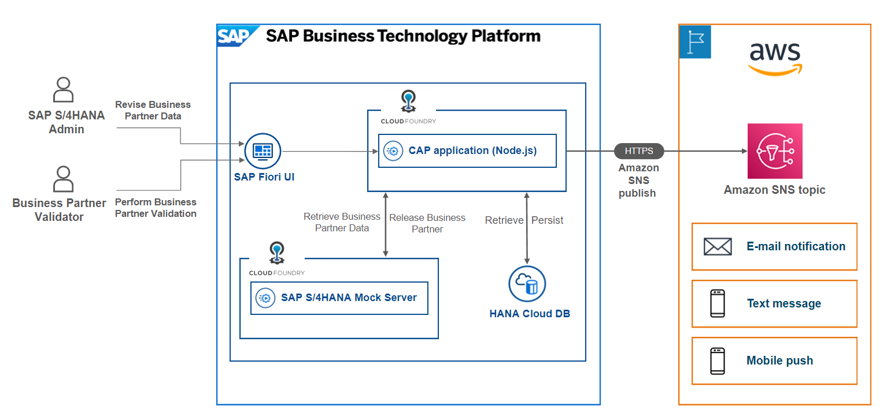
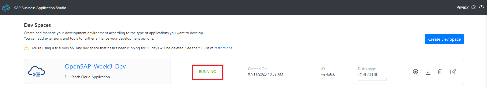
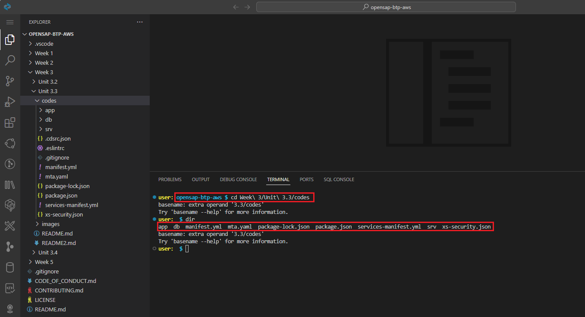
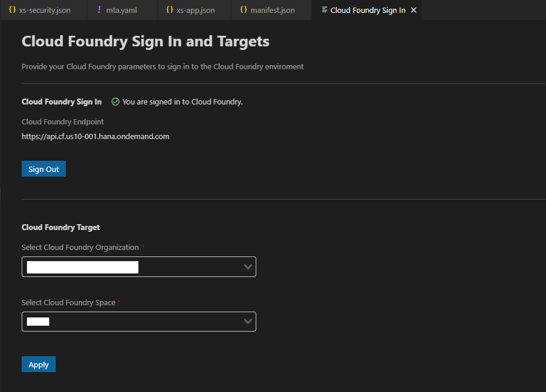

# Unit 3.3 Extend Business Process Using a CAP Application on SAP BTP

This exercise is part of the openSAP course [Build Resilient Applications on SAP BTP with Amazon Web Services](https://open.sap.com/courses/aws1), Week 3 Unit 3 - Extend a business process using a CAP application on SAP BTP.

The **objective** of this exercise focuses on how to build a business application by using SAP Cloud Application Programming (CAP) to extend the SAP S/4HANA business process. After finishing this exercise, you will successfully achieve the objectives below
  - Have a basic understanding of the SAP Cloud Application Programming (CAP) module
  - Build your first backend service by using SAP CAP for SAP S/4HANA Business Partner manipulation and validation purposes in Node.js
  - Build your first front-end application by using Fiori Element UI for SAP S/4HANA Business Partner manipulation and validation purposes.
  - Have a deep understanding of connecting backend CAP service with frontend Fiori UI.

## Overview - What You Will Build 



During this exercise, we will be guiding you to build a Full-Stack application to extend the SAP S/4HANA Business Partner validation business process. 

We will build the backend service in SAP CAP with Node.js, persist the business partner data in the SAP HANA Database hosted in the SAP HANA Cloud and build the frontend application as the entry point of the entire system with SAP Fiori Elements UI.

You can use SAP S/4HANA Cloud or build a mock service in SAP BTP for this exercise. If you have already completed exercises in unit 2.2, you can leverage the same mock service for this week's exercise as well.

As you can see from the system architecture above, there are two personas, the SAP S/4HANA Admin and Business Partner Validator. The SAP S/4HANA Admin will log in to this system via the Fiori UI and view the business partner data, which is fetched from the SAP S/4HANA Mock Server. If they find something is not right, he/she could make changes to the business partner data in the Fiori UI and save the changes after that. This updated business partner data will be persisted into the HANA DB.

Once the SAP S/4HANA Admin has completed the changes, there will be an email notification sent out to the Business Partner Validator via the Amazon Simple Notification service. The Business Partner Validator could find the business partner ID from the email and jump to the Fiori UI by clicking the URL in the email to perform the validation. If everything looks good, then the Business Partner Validator could release the business partner in the Fiori UI, which will then get updated back to the SAP S/4HANA Mock Server.

No more waiting – let's jump into the world of coding with unwavering zeal and determination.

## Prerequisites

1. Please set up S4-Mock-Server application before you start this exercise. Please follow the [Setup S4-Mock-Server application guide](https://github.com/SAP-samples/btp-s4hana-nocode-extension/blob/main/setup/mock/README.md) to complete this step.

2. Please make sure the SAP HANA Database is up and running in the SAP HANA Cloud service instance.

### Section 1. Clone the Full-Stack Business Partner Validation Application From GitHub

In this section, we will focus on clone the full-stack Business Partner Validation application from GitHub in the Business Application Studio

---
**1.1** Login into your SAP BTP trial subaccount. Click the **Instance and Subscriptions** on the left menu, and then click **Go to Application** button of the SAP Business Application Studio service subscription.


**1.2** Now you will see the Dev Space we created previously is in **STOPPED** status, let us activate it by clicking the Run button 


**1.3** When it’s ready, open your dev space by clicking on the name. 



**1.4** Now you should be in the cloud IDE provided by the SAP Business Application Studio service. Let's clone the Business Partner Validation Full Stack application from the GitHub. Click **hamburger button** on the upper left corner, then select **Terminal** -> **New Terminal** from the drop-down menu.


**1.5** Now issue the command as below to go into the "**projects**" directory. This is the directory that SAP Business Application Studio used to contains the CAP project by default.

  ```sh
  cd projects
  ```


**1.6** Issue the command as below to clone the Week3 Unit 3 source code. Then give your GitHub credentials in the text bar on the upper side.

  ```sh
  git clone https://github.com/SAP-samples/btp-aws1-opensap.git
  ```


**1.7** After a while the git clone will be done. You will see the clone details in your terminal once it is finish successfully.


**1.8** Now lets switch to the directory, which contains the Week 3 Unit 3 exercise'source code, by issue the command in the terminal as below.

  ```sh
  cd Week\ 3/Unit\ 3.3/codes
  ```

  Although you will see basename error, but it doesn't matter.



**1.9** Now we have finished clone the Business Partner project from the GitHub successfully. Let's move forward to the next section for SAP BTP Trial Subaccount deployment.

### Section 2. Deploy Full-Stack Business Partner Validation Application to SAP BTP Trial

In this section, we will focus on deploy the Business Partner Validation application we just cloned from GitHub to your SAP BTP Trial subaccount.

---
**2.1** Open the **package.json** file under the project's root directory. Replace the s4_mock_server domain name at line No.43 and line No.48 to your S4-Mock-Server application's host name.


**2.2** Issue the commands below to install the all the NPM packages required, and build the full stack application, in-order to make it ready for the SAP BTP Trial subaccount deployment.

  ```sh
  npm install --save
  ```

  ```sh
  cds build
  ```

**2.3** **Right click** on the **mta.yaml** file, and click **Build MTA Project** from the drop-down menu, to build the mtar file which will be used for the SAP BTP Trial subaccount deployment.


**2.4** Once the MTA Build process is successful, you will see the **build complete message** in your **terminal**. Also, there will be a **business-partner-validation_1.0.0.mtar** file generated under the **mta_archives folder**.


**2.5** Right click on the generated **business-partner-validation_1.0.0.mtar** file under the **mta_archives** folder. Then select **Deploy MTA Archive** option from the menu. This will start the deployment process.


**2.6** The **Cloud Foundry Sign In and Targets** page will be pop-up. Choose the **Credentials** as the **Select authentication method**, then **enter the username and password you used to login to the SAP BTP Trial subaccount**. Click **Sign in**.


**2.7** Select your SAP BTP trial subaccount and space, then click **Apply** to complete the sign in. 



**2.8** After you sign-in successfully, the MTA deployment will be triggered. The deployment can take some minutes. After successful deployment, you will see the **Process finished** without any error statement in your terminal.


### Congratulations on successfully completing the process of cloning the full-stack Business Partner Validation application from the GitHub repository and deploying it to your SAP BTP subaccount in the SAP BTP Trial. 

### Please go back to the main instruction and continue your learning, start from [Section 5 Step 4](https://github.com/anbazhagan-uma/opensap-btp-aws/blob/main/Week%203/Unit%203.3/README.md#step-4-setup-fiori-ui-application-in-sap-build-workzone).
