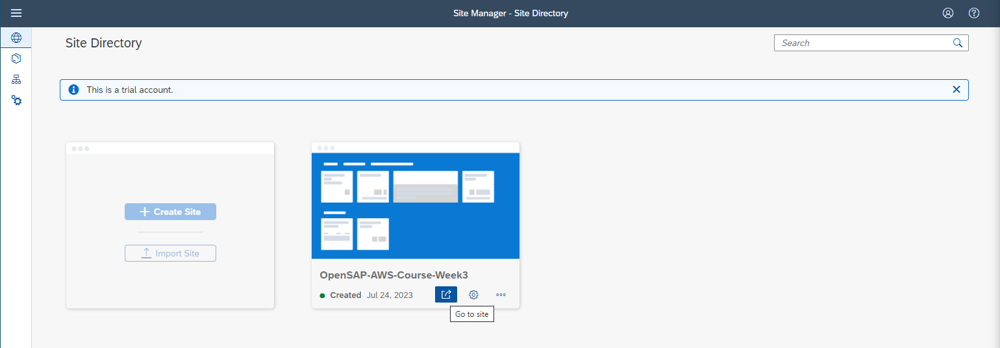

# Unit 3.4 Integrate the SAP CAP Application with Amazon SNS Service

This exercise is part of the openSAP course [Build Resilient Applications on SAP BTP with Amazon Web Services](https://open.sap.com/courses/aws1), Week 3 Unit 4 - Integrate the CAP Application with Amazon SNS.

In the exercise of this unit, we will introduce how to integrate the Amazon Simple Notification Service (SNS) with our Business Partner Validation application using the AWS SDK for SNS. After finishing this exercise, you will achieve the following objectives
 - Understand how to configure the Amazon Simple Notification Service Topic on the AWS Management Console.
 - Understand how to protect your Amazon SNS Topic with the Amazon IAM Access Policy.
 - Understand how to consume the Amazon SNS Topic programmatically within the SAP CAP project by using the AWS SDK for SNS.

**You can find the complete sample code of this exercise [here](../sample-code)**.

## Section 1. Setup Amazon Simple Notification Service (SNS)

<details>

> - Please note down below values after you finish this section
>   - Amazon SNS Topic ARN
>   - Amazon SNS Topic Reigon
>   - Amazon IAM User Access Key
>   - Amazon IAM User Secret Access Key

Amazon Simple Notification Service is a regional service, please create the Amazon SNS Topic in the AWS region which is in a similar region of your BTP subaccount, so that we can minimize the latency.

### Step 1. Create Amazon SNS Topic

---
**1.1** Open **Amazon Simple Notification Service Management Console**, click **Topics** on the left panel, then click the **Create Topic** button.


**1.2** Select **Standard** Topic type, give the proper topic name and display name. **Leave everything as what it is**, and click the **Create topic** button. 


**1.3** Once the topic creation is complete successfully, **note down** the **Topic ARN** (Amazon Resource Name) and **Topic Region** value. We will use it later in the exercise.For example, if you have the ARN value as **arn:aws:sns:us-east-1:209247607196:openSAP-AWS-Week3**, your value for region will be **us-east-1**.

> - You could find the Topic Region value inside of the Topic ARN.


**1.4** Click on the **Create Subscription** button. In the **Create subscription screen**, choose **Protocol** as **Email**, and then **give your email address** to the **Endpoint**, then click the **Create subscription** button to complete the topic subscription. 


**1.5** You will receive an email asking for confirmation of the topic subscription. Follow the instructions in the email to confirm the subscription. Please check your spam folder as well in case you do not see the email in your inbox.


### Step 2. Setup Amazon IAM Access Policy

---
**2.1** Open the Amazon **Identity and Access Management (IAM)** management console. Select **Policies** on the left menu and then click **Create policy** to create a new IAM policy.


**2.2** In the **Specificy permissions** screen, select **Service** as **SNS**, choose **Actions allowed** as **Publish**, and enter the **SNS Topic ARN** value with the one we just created. Click **Next**.


**2.3** In the **Review and create** screen, give a proper, read-friendly name for this new IAM policy. Review everything, if it all looks good, click the **Create policy** blue button to create the new IAM policy. **Note Down the name of this policy**, as we will need it in the next step.


### Step 3. Setup Amazon IAM User with Access Key and Secret Access Key

---
**3.1** Open the Amazon **Identity and Access Management (IAM)** management console. Select **Users** on the left menu and then click **Create user** blue button to create a new IAM user.


**3.2** Give the proper, read-friendly name to your new IAM user, **do not grant AWS management console access**, then click Next.


**3.3** Choose **Attach policies directly**, then **attach the IAM policy we just created in the last step** to it. Click **Next**.


**3.4** Review everything, if it all looks good, click the **Create user** to create the new IAM user.


**3.5** Switch to the **Security credentials** tab, and then click **Create access key** button in the Access keys section.


**3.6** Choose **Application running outside AWS**. Click **Next**.


**3.7** Click **Create access key** button to finish the access keys creation.

**3.8** **Note down** the value of **Access Key**, **Secret access key**, and **IAM User ARN**. This is the only time that you could view the value of these keys.


### Step 4. Update Access Policy of Amazon SNS Topic

---

**4.1** Go back to the **Amazon Simple Notification Service Management Console** and select the SNS Topic we just created in the previous step. Click Edit button.


**4.2** Expand the **Access policy** tab. Overwrite the access policy as shown on below. Then click **Save changes** button.

```node.js
{
  "Version": "2008-10-17",
  "Id": "__default_policy_ID",
  "Statement": [
    {
      "Sid": "__default_statement_ID",
      "Effect": "Allow",
      "Principal": {
        "AWS": "IAM-USER-ARN-WE-JUST-CREATED"
      },
      "Action": "SNS:Publish",
      "Resource": "AMAZON-SNS-TOPIC-ARN"
    }
  ]
}
```


</details>


## Section 2. Consuming the Amazon Simple Notification Service Topic in SAP CAP Project.

<details>

### Prerequisites
You have completed Section 1 of this week and have the below values handy.
- **Amazon SNS Topic ARN**
- **Amazon SNS Topic Region**
- **Amazon IAM User Access Key**
- **Amazon IAM User Secret Access Key**
- **Frontend Fiori application's URL** 


### Step 1. Install AWS SDK for Node.js in the SAP CAP Project

---
**1.1** Open the Business Partner Validation project in the SAP Business Application Studio. Open a new terminal and then issue the command **npm install @aws-sdk/client-sns --save**


**1.2** After the installation is completed, open the **package.json** file under your project root directory. You will see that the AWS SDK - SNS Client has been added under the **dependencies** section.


### Step 2. Modify the SAP CAP Project Code

---
**2.1** Let's **modify the package.json file** under the **project's root directory**, so that we could add the AWS SNS credentials, and also the frontend Fiori application's endpoint as the environment variables. Add the code shown on below into your package.json file under the **cds.requires** section.

```node.js
"cds":{
  ...
  "requires":{
    ...
    "aws": {
      "sns": {
        "topicArn": "REPLACE-WITH-YOUR-AWS-SNS-TOPIC-ARN",
        "region": "REPLACE-WITH-YOUR-AWS-SNS-TOPIC-REGION"
      },
      "iam": {
        "accessKey": "REPLACE-WITH-YOUR-AWS-IAM-USER-ACCESS-KEY",
        "secretAccessKey": "REPLACE-WITH-YOUR-AWS-IAM-USER-SECRET-ACCESS-KEY"
      }
    },
    "launchpad": {
      "url": "REPLACE-WITH-YOUR-FRONTEND-FIORI-APPLICATION-URL"
    },
  }
}
```


**2.2** Open the **srv/businesspartner-service.js** file. Let's first import the AWS SNS Client, and CAP CDS environment variables we just defined into this file. 

```node.js
const { SNSClient, PublishCommand } = require('@aws-sdk/client-sns');
const { aws, launchpad } = cds.env.requires;
```


**2.3** Let's creates an new async function, which will be responsible for sending out the email notification programmatically to the Amazon SNS Topic.

```node.js
async function sendEmailNotification(bpID){

    const REGION = aws.sns.region;
    const SNS_TOPIC_ARN = aws.sns.topicArn;
    const AWS_ACCESS_KEY_ID = aws.iam.accessKey;
    const AWS_SECRET_ACCESS_KEY = aws.iam.secretAccessKey;
    const businessPartnerID = bpID;

    const snsClient = new SNSClient({
        region: REGION,
        credentials:{
            accessKeyId: AWS_ACCESS_KEY_ID,
            secretAccessKey: AWS_SECRET_ACCESS_KEY,
        },
    });

    let message = `Business Partner ${businessPartnerID} Records Has Been Changed, Please Review and Perform the Validation ASAP. \n`;
    message += `Please use below link to go the site.\n`;
    message += launchpad.url;
    
    let params = {

        Message: message,
        TopicArn: SNS_TOPIC_ARN,
    };

    try{
        const data = await snsClient.send(new PublishCommand(params));
        console.log("Success.",  data);
    }catch(error){
        console.log(error.message);
    }
};
```


**2.4** Finally, let's **enhance** the **syncData function** to **leverage the sendEmailNotification function** we just created. Add the code shown below at the **very end** of the syncData function.

```node.js

async function syncData(req){

  ....,

  // Send out SNS Notification while Business Partner's Verification Status = P
  if(verificationStatus_code === 'P'){

    await sendEmailNotification(bpID);
  }
}
```


### Step 3. Deploy the Code Changes to the SAP BTP Trial Subaccount

> - Make sure your SAP HANA DB is in the running status. The SAP HANA DB in the SAP BTP trial account will stop every single night automatically.

---
**3.1** **Right click** on the **mta.yaml** file under your project root directory, and then choose **Build MTA Project** from the menu. 


**3.2** Once the MTA Build process is complete, expand the **mta_archives** folder, **right click** on the **business-partner-validation_1.0.0.mtar** file. Choose **Deploy MTA Archive** from the menu to trigger the SAP BTP trial deployment process.


**3.3** Wait until the deployment process is completed. Grab a cup of coffee and take a rest as the deployment process will take some time. In case there is a deployment issue in the trial account which says 'Your free tier usage limit exceeded', run the command cf deploy mta_archives/{REPLACE-WITH-YOUR-MTA-FILE-NAME}.mtar.

</details>

## Section 3. Testing the Business Partner Validation Application from End-to-End

<details>

**3.1** Go back to your SAP BTP Trial subaccount. Go to **Instance and Subscriptions**. Click **Go to application** button of the **SAP Build Work Zone, standard edition** service subscription.


**3.2** Click **Go to site** button to navigate to the OpenSAP-AWS-Course-Week3 site.



**3.3** Click Manage Business Partner App. Ensure you have the mock server and SAP HANA Cloud database in a running state.


**3.4** Now click **Go** to browse all unblocked Business Partner Data fetching from S4-Mock-Server. Now you will see all the Business Partners are in the VERIFIED status.


**3.5** Click on the first Business Partner 1004155 record in the table, this will navigate you to the details page. Let's now try to update the address data of this business partner by clicking the edit button.


**3.6** **Update the business partner data as shown on the image below**. Then click **Save** to persist the updated data to the SAP HANA DB. **Make sure to update the Verification Status value from V to P by selecting from the dropdown**. Now we should expected to receive an email notification sent from the Amazon SNS topic we created previsouly.


**3.7** Open your email box, then you should see an email with the tilte **AWS Notifications**. Open this email and you should see the message to indicate us the Business Partner 1004155 record has been changed. The Fiori application of the Business Partner Validation app is also includes in the email. We could click on this URL and it will redirect us back to the SAP Fiori application.


</details>

**Congratulations, you have successfully integrated the Amazon Simple Notification service with SAP CAP project and deployed the entire project to the SAP BTP Trial subaccount successfully. Well done !!**
