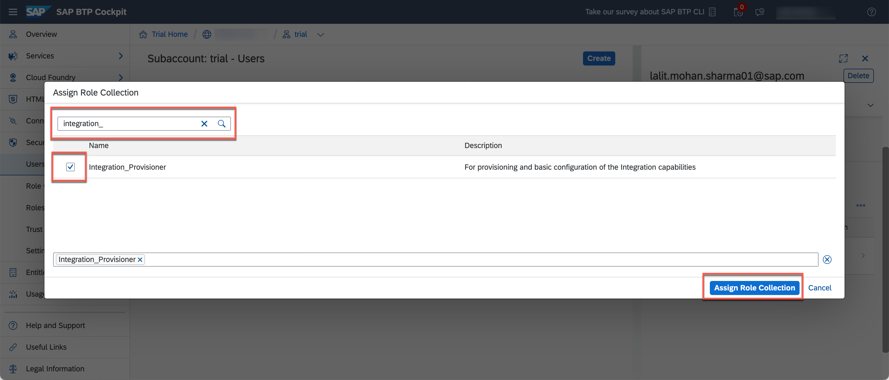
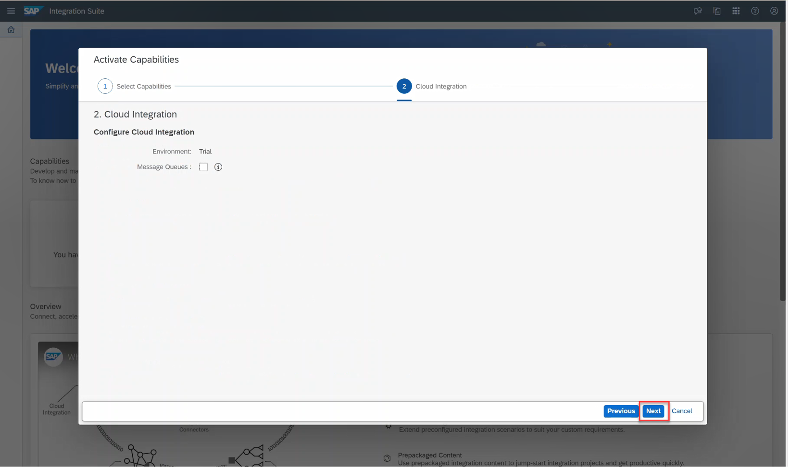
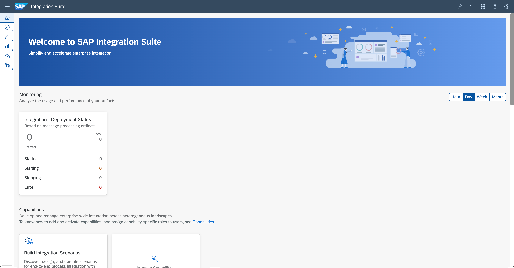
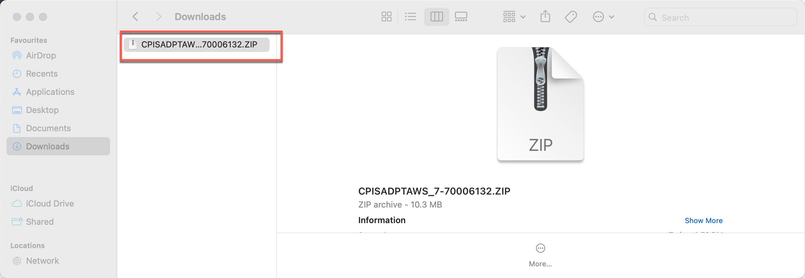
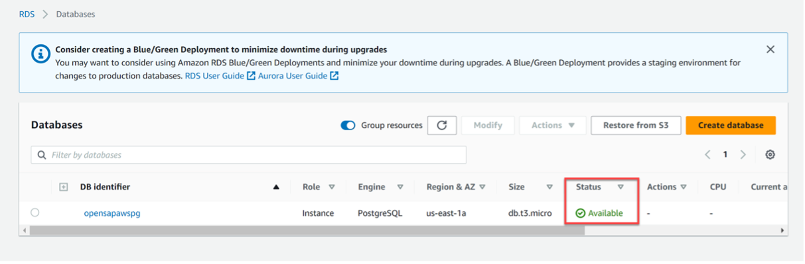

This exercise is part of the openSAP course [Building resilient applications on SAP Business Technology Platform with Amazon Web Services](https://open.sap.com/courses/aws1) - there you will find more information and context for Week 5 on Building Integration Scenarios.

# Setting up SAP BTP and AWS for Integration Scenarios
The objective of the exercise is to setup your Integration Suite instance within your **SAP Business Technology Platform** subaccount development and Discover and Explore **SAP Business Accelerator Hub** for the API which will be required in the upcoming course units. The Integration Suite contains the **Cloud Integration** component which you will use to read data or documents from your SAP systems and post it into Amazon S3 in Unit 3. 


## Prerequisites
You have created a trial account on SAP Business Technology Platform: [Get a Free Trial Account on SAP BTP](https://developers.sap.com/tutorials/hcp-create-trial-account.html)

## Step 1 - Enable SAP Integration Suite
Welcome to the Unit 2 of Week 5. In this first step, you will add an Integration Suite Application Subscription to your SAP BTP subaccount. This will be the central entry point for all required **Integration Suite** components like **Cloud Integration** or Open Connectors.

---
1.1 In your web browser, open the [SAP BTP trial cockpit](https://cockpit.hanatrial.ondemand.com/). Navigate to the trial global account by choosing Go To Your Trial Account.


1.2 From your global account page, choose the appropriate subaccount’s e.g., **trial** tile to navigate.


1.3 Go to **Service**-> **Service Marketplace**. Search for **Integration** and select the **Integration Suite** form the search result.


1.4 Click on **Create** on the right side of your screen.


1.5 In the popup, choose the default plan which is **trial** for the service type **Integration Suite** and then choose **Create**. You are subscribed to the service now.

1.6 The request for a new subscription is submitted and you can watch the status by clicking on **View Subscriptions**.


1.7 Check your **Integration Suite** subscription in the **Instances and Subscriptions** menu of your SAP BTP cockpit. Once the status changes to **Subscribed**, the Integration Suite instance is ready to be used.


**Congratulations! You have successfully created an Integration Suite application subscription. In the next section you will be guided through step to assign the required authorizations to your user.**

## Step 2 - Assign Integration Provision User Role

For activating the SAP Integration Suite capabilities, your user should have the Integration Provision role collection. In this step, you will assign the role to your user.

---
2.1 Select **Security > Users**. Choose your User Name/Email to assign the Integration Suite relevent.


2.2 In the Role Collections section, select the more options(...icons) and choose **Assign Role Collection** from the pop-over.


2.3 In the dialog that appears, select **Integration_Provisioner**. Choose **Assign Role Collection**.


2.4 After role assignment, a sign-out and re-login may be required. Select the drop down (˅) next to your username in the title bar, choose **Sign Out**.

2.5 Click on **sign in again** to login to SAP BTP trial.


**Congratulations, you have assigned the required role to provision SAP Integration Suite capabilities. In the next section, you will be guided through the steps to activate the Cloud Integration capability of SAP Integration Suite.**

## Step 3 - Activate Cloud Integration Capability

In this step, you will use the Integration Suite Provisioning tool, to enable the required capabilities within your Integration Suite instance. This includes Cloud Integration and Open Connectors, which will be used in the subsequent steps and weeks of this course.

---
3.1  In the **Instances and Subscriptions** menu, click on **Integration Suite** or the small icon next to Integration Suite application subscription, to open the respective application (The visibility of the icon might depend on your screen size).


3.2 In the Integration Suite home page, choose **Add Capabilities** to activate the capabilities offered by Integration Suite.


3.3 In this course, Cloud Integration capabilities is used. To enable this capability, Select option Build Integration Scenarios. Choose **Next**.


3.4 You can optionally enable the message queues features. For this course, this feature was kept unchecked. Select **Next** to move to next step.


3.5 Select **Activate** to enable the Cloud Integration capability in your SAP Integration Suite tenant.


3.6 The activation takes a while to complete. Choose **Ok** and proceed with other activities in your SAP BTP trial environment.


3.7 To view the latest status, you can select the option **Add Capabilities.**


3.8 Status will change to Active, after the required capabilities is successfully enabled.


**Congratulations! You have successfully provisioned the Integration Suite components. In the next step you will learn, how to assign your user the required authorizations, to access the various Integration Suite components.**

## Step 4 - Assign roles and create service instances

In this step, you will execute a Booster that assigns your user the necessary roles to access the activated capabilities from Step 3. Furthermore, the Booster will create additional service instances like the Process Integration Runtime. This service instance defines, how the Process Integration Runtime service can be called from a remote component. In case of Cloud Integration, a service instance is an OAuth client. The service instance allows you to create Service Keys, containing credentials and other information, required to call integration flows.

---
4.1 Navigate to the overview page of your SAP BTP global account.


4.2 Choose **Boosters** on the left navigation pane.From the list of boosters, look out for the tile **Enable Integration Suite**. You can start the booster execution by clicking or by choosing *Start* on the tile.


4.3 Read the information and choose **Start** in the Booster page.


4.4 In the Configure Subaccount tab, select your subaccount, organization, and space in which you have subscribed for Integration Suite service. Choose **Next**.


4.5 Select the activated **capabilities**. For this exercise, select option Design, Develop and Operate Integration Scenarios. Select **Next** to continue.


4.6 In the Review tab, check your selections and choose **Finish**. You can see that the booster is being processed.


4.7 You can view the progress of each steps and wait for the activity step.


4.8 Select **Navigate to Subaccount** option to navigate to your SAP Integration Suite tenant.


4.9 Navigate to **Subaccount** then User and select your user to assign new roles 


4.10 Search for the **PI roles**, select all the roles and assign.


4.11 For role assignment to be applied, now go to your application, sign out and sign in again. Select the **user icon** on the title bar and select **Logout** from the drop-down menu.


4.12 Click on SAP Integration Suite to **sign-in** again.


4.13 You will be navigated to the landing page of your SAP Integration Suite tenant.


**Congratulations, you have successfully completed all on-boarding steps for using Cloud Integration capabilities of SAP Integration Suite. You can start using SAP Integration Suite to build, deploy and run your integration flows.**

## Step 5 - Deploy Amazon Web Services Adapter to SAP Integration Suite

For integration with AWS services like S3, SQS Amazon Web Services adapter is available in SAP Integration Suite. The Adapters are included with all licenses of SAP Integration Suite. It can be downloaded from the **SAP Software Download center**.

> **_Note :_** Accessing the SAP Software Download center may require you to login using your S_User.

---
5.1 Go to your **SAP Integration Suite** tenant. Navigate to **Integration tab** under Discover to view all the out-of-box integration content and adapters published in[ SAP Business Accelerator Hub (formerly known as SAP API Business Hub)](https://api.sap.com/).


5.2 Enter **AWS** in the search field and select the magnifier or **search** icon to search for the AWS adapters.


5.3 Select the **package** Amazon Web Services Adapter for SAP Integration Suite.


5.4 Scroll down to Download Location section in **Overview tab**. AWS adapter is available in both SAP CP IS Adapter Advance Pack and SAP CP IS Base Pack. Click **SAP CP IS Adapter Base Pack** link. You will be navigated to directly to the SAP Software Download Center.


5.5 Select **SAP CP IS ADAPTER BASE PACK**


5.6 Navigate to **DOWNLOADS** tab and select SAP CPIS AWS ADAPTER


5.7 Click on the available CPISADPTAWS_* package to download the latest adapter zip. This will download the zip files to the default download location configured in your browser settings.


5.8 Navigate to your **Download** file location. Open the recently downloaded adapter package. The package contains the required documentation and adapter installer related to AWS adapter.


5.9 Unzip the adapter zip file in your local file location. The required installer file AmazonWebServices.esa would be available under Adapter folder of the **unzipped** file.


5.10 Navigate to your SAP Integration Suite tenant. Select **Design -> Integrations** tab. Select **Create** to create a new Integration package.


5.11 You can provide the name and short description for the integration package. Enter **AWS Adapters** in the Name field, Adapters for AWS Integrations in the Short **Descriptions** field. Select **Save** to create the integration package.


5.12 Navigate to **Artifacts tab** of the newly created integration package. Select **Add** to add in the AWS adapter


5.13 Select **Integration Adapter** from the drop-down menu.


5.14 Select **Browse** to browse and select the **AmazonWebServices.esa** file from your local file location.


5.15 Select **Ok** to add the AmazonWebServices.esa adapter to your SAP Integration Suite tenant.


5.16 Select the **launch icon** from the Actions column of AmazonWebServices artifact. Select **Deploy** to deploy the Amazon Web Services adapter in your SAP Integration Suite tenant.


5.17 You can monitor the deployment status of the AmazonWebServices adapter by navigating to **Monitor->Integration tab**. Select All tile from Manage Integration Content to monitor all integration artifacts.


5.18 Deployment of any integration content or adapter on a newly provisioned SAP Integration Suite tenant may take time. Select **Refresh icon** to view the latest status.
 

5.19 Status will change to **Started**, for a successfully deployed integration artifact.


You may get certificate error while using Amazon Web Service adapter in some scenarios. To fix this issue, the root certificates from Amazon needs to be imported into your SAP Integration Suite tenant.

5.20 Download Amazon **certificate** for CN=Amazon Root CA 1,O=Amazon,C=US from https://www.amazontrust.com/repository/.  Click on DER link to download the required certificate to your local file location.
 

5.21 Navigate to your SAP Integration Suite tenant. Select **Monitor-> Integrations** tab. Select Keystore tile from Manage Security section.
 

5.22 Select **Add** and then **select** Certificate from the drop-down menu option.
 

5.23 Select **Browse** from the Add Certificate dialog, to browse and **select** the downloaded Amazon root certificate from your local file location.
 

5.24 Select **Add** to add the Amazon root certificate to your SAP Integration Suite tenant.
 

5.25 you successfully upload the certificate in SAP Integration Suite.

 

**Congratulation, you have successfully deployed the Amazon Web Services adapter in your SAP Integration Suite tenant. You can use this adapter to build, deploy and run any integration flow connecting to Amazon services like S3, SQS.**

## Step 6 - Discover and Explore SAP Business Accelerator Hub

The SAP Business Accelerator Hub is a web application hosted by SAP to discover, explore, and test SAP and partner APIs (application programming interfaces) that are required to build extensions or process integrations. It also hosts Integration content, Events, CDS views, and more.

---
6.1 To Discover, Explore SAP S/4HANA Cloud APIs **navigate** to SAP Business Accelerator Hub
 

6.2 Navigate to the [Bank details API](https://api.sap.com/api/API_BANKDETAIL_SRV/overview) from S/4HANA Cloud package.
 

6.3 From SAP Business Accelerator Hub, you can explore and try out the selected API. For accessing the API sandbox from the SAP Integration Suite, the API Key is required. To access your **API sandbox key**, first click on **Login** to sign-in to SAP Business Hub Accelerator.
 

6.4 Select Show API Key to **view** and **copy** your API sandbox key.
 

6.5 Select **Copy** Key and **Close** option to copy the API sandbox key. Note this key down, it will be using later in the tutorial while building the integration flow to fetch bank details from SAP S/4HANA Cloud sandbox system.
 

6.6 Choose **Try out** to execute the APIs.
 

6.7 API provider can host a service to enable test experience of an API listed in API Business Hub. Logged in user can experience this API without having account/license for specific API.

we will be useing the **Sandbox Environment** for building the integration flow. Choose **Run**.
 

6.8 Observe the API response in the response body of the API. Note this Request Url, it will be using later in the tutorial while building the integration flow to fetch bank details from SAP S/4HANA Cloud sandbox system.
 

**Congratulation, you have successfully discovered the SAP Business Accelerator Hub and accomplished executing and testing of [Bank details API](https://api.sap.com/api/API_BANKDETAIL_SRV/overview) requied for building the integration flow**

## Step 7 - Set up PostgreSQL database in Amazon    
    
To keep this tutorial short, only the key steps are covered. The full steps and explanation of the various configurations is available in this Hands-on AWS tutorial.    

---
### 7.1 Create PostgreSQL database in Amazon   

7.1.1 Login to your AWS account. Navigate to Services->Database and select RDS

 
7.1.2 Select Create database   


7.1.3 Select Standard create, PostgreSQL and Free tier option


7.1.4 Set the DB identifier to say opensapawspg. Set the username and password of your choice


7.1.5 Since this is test or demo activity, you can optionally set the Allocated Storage to the minimum GB allowed and uncheck Enable storage autoscaling option, to save on consumption.


7.1.6 Set the public access to Yes to that the database can be accessed from external applications like SAP Integration Suite


7.1.7 Set the option to Create new VPC security group. Specify an easily identifiable group name say opensapawssecuritygroup. In later steps, the newly created security group will be modified to allow incoming traffic from SAP Integration Suite tenant


7.1.8 To keep it simple in the tutorial, select Password authentication as Database authentication options. Optionally, you can uncheck Turn on Performance insight options.


7.1.9 Expand Additional configuration section. Set the Initial database name to say opensapawsdb. You can optionally uncheck Enabled automated backup option.


7.1.10 Select Create database to create the PostgreSQL database. Note, you may encounter the issue reported in this [GitHub thread](https://github.com/crossplane/crossplane/issues/2040). In such case, selecting a different AWS region may resolve the issue.


7.1.11 The database creation may take time. Wait for the status to change to Available



Congratulations, you have successfully created a PostgreSQL database for test and demo purposes. In the next section, you will be guided through steps to connect to your database from a SQL client.

### 7.2	Connect to PostgreSQL database from a SQL client

Follow the steps mentioned in section Download a SQL client and Connect to the PostgreSQL database mentioned in this [Hands-on AWS tutorial](https://aws.amazon.com/getting-started/hands-on/create-connect-postgresql-db/).    

7.2.1 Connect from the SQL Client to your PostgreSQL database

>**Note**     
>- URL format: jdbc:postgresql://**{Host Url}**:**{Port}**/**{Initial DB Name}**
>- Host Url and Port can be fetched from the details of DB instance
>- Initial DB Name - Name provided in step 7.1.9


7.2.2 Copy and paste the following SQL statements into the SQL console and then select the Play icon. These SQL statements generate the schema, table and sample values which will be later used in tutorial Online VAT Number Validation.
```sql 
create schema EU
create table EU.MSXI(
   countryCode TEXT PRIMARY KEY not null,
   countryName TEXT not null
);
 
INSERT INTO EU.MSXI (countryCode, countryName) VALUES ('AT','Austria');
INSERT INTO EU.MSXI (countryCode, countryName) VALUES ('BE','Belgium');
INSERT INTO EU.MSXI (countryCode, countryName) VALUES ('BG','Bulgaria');
INSERT INTO EU.MSXI (countryCode, countryName) VALUES ('CY','Cyprus');
INSERT INTO EU.MSXI (countryCode, countryName) VALUES ('CZ','Czech Republic');
INSERT INTO EU.MSXI (countryCode, countryName) VALUES ('DE','Germany');
INSERT INTO EU.MSXI (countryCode, countryName) VALUES ('DK','Denmark');
INSERT INTO EU.MSXI (countryCode, countryName) VALUES ('EE','Estonia');
INSERT INTO EU.MSXI (countryCode, countryName) VALUES ('EL','Greece');
INSERT INTO EU.MSXI (countryCode, countryName) VALUES ('ES','Spain');
INSERT INTO EU.MSXI (countryCode, countryName) VALUES ('FI','Finland');
INSERT INTO EU.MSXI (countryCode, countryName) VALUES ('FR','France');
INSERT INTO EU.MSXI (countryCode, countryName) VALUES ('HR','Croatia');
INSERT INTO EU.MSXI (countryCode, countryName) VALUES ('HU','Hungary');
INSERT INTO EU.MSXI (countryCode, countryName) VALUES ('IE','Ireland');
INSERT INTO EU.MSXI (countryCode, countryName) VALUES ('IT','Italy');
INSERT INTO EU.MSXI (countryCode, countryName) VALUES ('LT','Lithuania');
INSERT INTO EU.MSXI (countryCode, countryName) VALUES ('LU','Luxembourg');
INSERT INTO EU.MSXI (countryCode, countryName) VALUES ('LV','Latvia');
INSERT INTO EU.MSXI (countryCode, countryName) VALUES ('MT','Malta');
INSERT INTO EU.MSXI (countryCode, countryName) VALUES ('NL','The Netherlands');
INSERT INTO EU.MSXI (countryCode, countryName) VALUES ('PL','Poland');
INSERT INTO EU.MSXI (countryCode, countryName) VALUES ('PT','Portugal');
INSERT INTO EU.MSXI (countryCode, countryName) VALUES ('RO','Romania');
INSERT INTO EU.MSXI (countryCode, countryName) VALUES ('SE','Sweden');
INSERT INTO EU.MSXI (countryCode, countryName) VALUES ('SI','Slovenia');
INSERT INTO EU.MSXI (countryCode, countryName) VALUES ('SK','Slovakia');
INSERT INTO EU.MSXI (countryCode, countryName) VALUES ('XI','Northen Ireland');
```


7.2.3 Select the Commit icon to commit the transaction


7.2.4 Copy and paste the following SQL statements into the SQL console and then select the Play icon.  This will return the recently persisted values from your PostgreSQL database
```sql 
select * from eu.msxi
```


Congratulation, you have successfully connected from a SQL client to your database and set up the sample values required for tutorial Online VAT Number Validation. In this next section, you will be guided through the steps to enable incoming traffic SAP Integration Suite to your PostgreSQL database in AWS.

### 7.3	Allow Incoming Traffic from SAP Integration Suite 

The inbound rules of your PostgreSQL security group can be used to enable the incoming traffic from SAP Integration Suite. All the outgoing IP ranges of SAP Integration Suite trial environment is mentioned in [SAP Help Portal (SAP Integration Suite Virtual System Landscapes)](https://help.sap.com/docs/cloud-integration/sap-cloud-integration/virtual-system-landscapes). For more information, you can also refer the [SAP Help Portal (Regions and API Endpoints Available for the Cloud Foundry Environment)](https://help.sap.com/docs/BTP/65de2977205c403bbc107264b8eccf4b/f344a57233d34199b2123b9620d0bb41.html?q=IP%20Ranges). 

7.3.1 Navigate to your PostgreSQL instance in Amazon. Select your PostgreSQL database


7.3.2 Select the VPC security group


7.3.3 Navigate to Inbound rules tab and select Edit Inbound roles


7.3.4 Add in the IP ranges for SAP Integration Suite trial environment as mentioned in [SAP Help Portal (SAP Integration Suite Virtual System Landscapes)](https://help.sap.com/docs/cloud-integration/sap-cloud-integration/virtual-system-landscapes) and select Save rules.


Congratulations, you have successfully configured the required IP rules to allow incoming traffic from SAP Integration Suite to your PostgreSQL database in AWS. In the next section, you will be guided through the steps to set up JDBC configuration in the SAP Integration Suite tenant.

### 7.4	Set up JDBC configuration in SAP Integration Suite

7.3.1 Navigate to your SAP Integration Suite tenant. Select Monitor-> Integrations tab. Select JDBC Material tile from Manage Security section.


7.3.2 Navigate to JDBC Data Source and select Add.


7.3.3 Enter a name for your JDBC data source, say opensapawspg. This name will be used from JDBC adapters to connect to your database. Enter the User, Password and JDBC URL as used from the SQL client in section 7.2 Connect to PostgreSQL database from SQL client. Select Deploy to save the configuration.


Congratulations, the JDBC data source is now configured in you SAP Integration Suite.  

## Summary

Congratulations! You have successfully configured your Integration Suite including the required authorizations for your user. This allows you to start development within the Cloud Integration. This concludes the exercise content of Week 5 - Unit 2. You can continue with the content of Week 5 - Unit 3.
