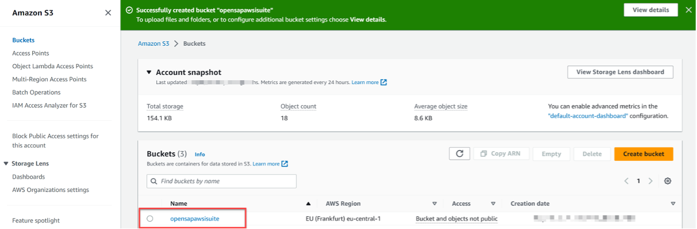
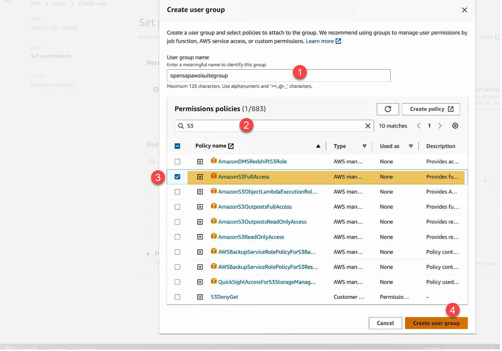
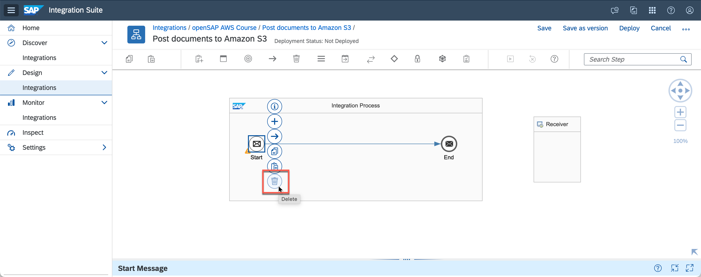
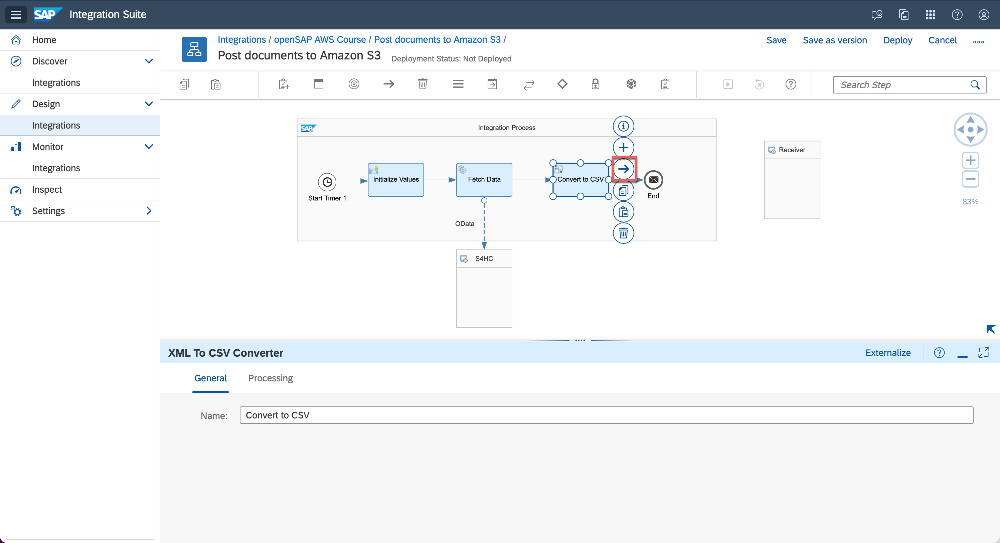

This exercise is part of the openSAP course [Building resilient applications on SAP Business Technology Platform with Amazon Web Services](https://open.sap.com/courses/aws1) - there you will find more information and context for Week 5 on Building Integration Scenarios.

# Post documents to Amazon S3
The objective of this exercise is to get your hands "dirty" and develop the target scenario, using the development environment which you've set up in the last two units. You going to use the Cloud Integration capability of SAP Integration Suite which provides adapters to easily connect SAP System to Non-SAP systems like Amazon. The integration flow (which you will develop end-to-end in this unit), contains all the steps and logic required, to read data or documents from your SAP systems and post it into Amazon S3.

## Prerequisites
1. You have created a trial account on SAP Business Technology Platform: [Get a Free Trial Account on SAP BTP](https://developers.sap.com/tutorials/hcp-create-trial-account.html)
2. Steps to enable SAP Integration Suite in SAP BTP trial and rest of the configuration for setting the Amazon Web Services adapter, S3 related configurations is covered in the [Unit 2](../Unit%205.2/README.md) 

## Step 1 - Configure S3 buckets

This section contains steps to configure the S3 buckets and set up the programmatic access to Amazon S3.

1.1  Login to your AWS account. Navigate to **Services->Storage** and select **S3**.

1.2 Select **Create Bucket** to create a new S3 bucket. Alternatively, you can re-use an existing bucket.

1.3 Enter the S3 Bucket name, say **opensapawsisuite** and select your AWS Region. Note down these values, it would be used later in the Amazon Web Services Adapter configurations in tutorial Post documents to Amazon S3.

1.4 Scroll down and select Create Bucket.

1.5 Select the S3 bucket to create a new folder for publishing documents via SAP Integration Suite.

1.6 Select Create folder.

1.7 Enter a folder name, say demo. Select Create folder to create a folder in your selected S3 bucket. Note down your folder name, it would be used later in the Amazon Web Services Adapter configurations in tutorial Post documents to Amazon S3.

Congratulations, you have successfully created S3 buckets, folders. In the next section, you will be guided through steps for generating S3 access keys and secrets.  

## Step 2 - Create S3 Access Keys

This section contains steps to create S3 access keys and secret for programmatic access to your S3 buckets.

2.1 Navigate to Services->Security, Identity & Compliance and select IAM.

2.2 Select User to create a new user. Alternatively, you can use an existing user which has programmatic access to S3 resources enabled.

2.3 Select Add User to add a new user.

2.4 Specify a username, say opensapawsisuiteuser and select Next.

2.5 Select Create group to create a new group for this user. Alternatively, an existing user group which has S3 access policies set can be used

2.6 Specify a group name, say opensapawsisuitegroup. Search for S3 policies. Select AmazonS3FullAccess policy and select Create user group.

2.7 Select the newly created user group, opensapawsisuitegroup and then select Next.

2.8 Select Create user to create the user named opensapawsisuiteuser.

2.9 Next, the access key & secret is to be generated for this newly created user. Search and select for the newly created user named opensapawsisuiteuser.

2.10 Navigate to Security credentials tab.

2.11 Scroll down to Access keys region. Select Create access key.

2.12 Select Other option and then select Next to generate the access keys.

2.13 Set an optional description tag, say opensapawsisuitedemo and select Create access key.

2.14 Select copy icon on Access Key and Secret access key to copy the access key and secret. These values will be used in next section to create the required security credentials to access S3 resources from SAP Integration Suite.  Before selecting Done, first securely store the Access key and Secret access key in your SAP Integration Suite as described in the next section. Alternatively, note these values for later use. 

Congratulation, you have successfully generated the access key & secrets for accessing S3 resources from SAP Integration Suite. In the next section, you will be guided through steps for creating the security credentials in SAP Integration Suite for S3 access.

## Step 3 - Configure S3 secure access in SAP Integration Suite

3.1 Navigate to your SAP Integration Suite tenant. Select Monitor-> Integrations tab. Select Security Material tile from Manage Security section.

3.2 Select Create and then Secure Parameter from drop-down menu.

3.3 Specify a name for your secure parameter say, S3AccessKey. Copy the S3 user access key generated in the previous section and paste the value in Secure Parameter and Repeat Secure Parameter field. Select Deploy to securely save this value in your SAP Integration Suite tenant.

3.4 Repeat the steps to securely store S3 access secret in SAP Integration Suite. Select Create and then Secure Parameter from drop-down menu. 
As before, specify a name for your secure parameter say, S3AccessSecret. Copy the S3 Secret access key generated in the previous section and paste the value in Secure Parameter and Repeat Secure Parameter field. Select Deploy to securely save this value in your SAP Integration Suite tenant.

Congratulations, you have securely saved the S3 access key and access secret key in your SAP Integration Suite. The name of your secure parameter will be used later. The table below summarizes all the values that used in this tutorial which will be subsequently used in the next step. Set these values to the value set up you for a quick reference later.

Field                                      | Value
------------------------------------------ | -------------
S3 Bucket Name                             | opensapawsisuite
AWS Region                                 | eu-central-Europe
S3 Folder Name                             | demo
Secure parameter name for S3 access key    | S3AccessKey 
Secure parameter name for S3 access secret | S3AccessSecret

## Step 4 - Create Post Document to Amazon S3 Integration Flow

At a high level, In the integration flow to post a document to Amazon S3, you will create a timer job to default start immediately after you deploy it. you need to initialize values to call SAP S/4HANA Cloud APIs via the API Sandbox of SAP Business Accelerator Hub using the Content Modifier step to call the SAP S/4HANA Cloud OData APIs to read the bank details in the Request-Reply Integration step.At last, you will convert the response into a CSV file using XML to CSV Converter and post it to Amazon S3 via an Amazon Web service adapter.

---

4.1 Go to your SAP Integration Suite tenant. Select Design -> Integrations tab. Select Create to create a new Integration package.

4.2 You can provide the name and short description for the integration package. Enter openSAP AWS Course in the Name field, Sample Scenarios for AWS and SAP openSAP course in the Short Descriptions field. Select Save to create the integration package.

4.3 Navigate to Artifacts tab of the newly created integration package. Select Add and select Integration Flow from the drop-down menu option.

4.4 You can provide a Name for your Integration flow in the Add Integration Flow dialog. Enter Post documents to Amazon S3 in the Name field and select OK.

4.5 Select the newly created Integration Flow named Post documents to Amazon S3 and then select Edit to start editing the integration flow.

4.6 Since a timer-based integration flow will be used the default start message and Sender can be deleted. Select the default Sender and select Delete icon. Select the default Start message and select Delete icon,

4.7 Select and add the Timer integration step. The default property of timer integration step is to execute the integration flow immediately after you deploy the integration flow. More about the available timer configurations is available in [help documentation](https://help.sap.com/docs/cloud-integration/sap-cloud-integration/define-timer-start-event?locale=en-US).

4.8 To API Sandbox key to read data from SAP S/4HANA Cloud API Sandbox from SAP Business Accelerator Hub, a Content Modifier can be used. Search Select Content Modifier integration step from the integration palette and drop it into Integration Process canvas.

4.9 Change the name of the content modifier step to Initialize Values in General tab to improve readability.

4.10 Navigate to Message Header tab and select Add. From the action drop down select Create, enter apikey as the Name of the property, select Constant from the drop down for Source Type and enter your copied API Key from SAP Business Accelerator Hub in the Source Value field. This will set the request message header named apikey with the value set by you to be passed to API Sandbox from SAP Business Accelerator Hub.

4.11 Select Start Timer integration step and then drag the arrow icon to point towards Connect Modifier step to connect the timer and content modifier integration step.

4.12 To read data using SAP S/4HANA Cloud sandbox APIs, the Request Reply integration pattern with an OData Receiver adapter can be used. Search and Select Request Reply from integration palette and drop it into Integration Process canvas.

4.13 Change the name of Request Reply step to Fetch Data in the General tab to improve readability.

4.14 Select and connect the Initialize Values integration step with Fetch Data step.

4.15 Add in Receiver integration step to invoke SAP S/4HANA Cloud OData API.

4.16 Name of the Receiver can be set to S4HC to improve readability.

4.17 Select and connect the Fetch Data integration step to the newly added Receiver. This would open the Adapter list, from the available Adapter select OData. Select OData V2 in the Message Protocol option dialog

4.18 Under the Connection tab, enter Address as https://sandbox.api.sap.com/s4hanacloud/sap/opu/odata/sap/API_BANKDETAIL_SRV.  Set the Authentication type to None.

4.19 Navigate to the Processing tab and enter following values under section PROCESSING DETAILS:
        Resourse Path: A_BankDetail
        Query Options:  $top=50&$inlinecount=allpages

4.20 Scroll down and navigate to section HEADER DETAILS and METADATA DETAILS. Set apikey in Request Headers fields. This enables the apikey header set in the Initial Values integration step to be passed to the API Sandbox during OData call.

4.21 To convert the OData XML response to CSV, XML To CSV converter step can be used. Search and Select XML to CSV Converter from integration palette and drop it into Integration Process canvas.

4.22 Change the name of XML to CSV converter step to Convert to CSV in the General tab to improve readability.

4.23  Navigate to Processing tab and enter /A_BankDetail/A_BankDetailType in the Path to Source Element in XSD field. Select the Include Field Name as Headers option. This will add the OData response parameter name as CSV header name.

4.24 Select and connect the Fetch Data integration step with Convert to CSV step.

4.25 Select and connect the Convert to CSV step to the End message to complete the integration process flow.

4.26 Select and connect the End message to Receiver to post the generated CSV file to Amazon S3. This would open the Adapter list, from the available Adapter select AmazonWebServices. Select S3 in the Message Protocol option dialog. Note, Amazon Web Service adapters needs to be deployed supported and these steps are covered in section Deploy Amazon Web Services Adapter to SAP Integration Suite of the Pre-requisites tutorial.

 
4.27 In the Connection tab, set the values as per your S3 configurations. These values were configured in the previous steps. 

Field            | Value
---------------- | -------------
Region           | eu-central-Europe
Bucket Name      | opensapawsisuite
Access Key Alias | S3AccessKey 
Secret Key Alias | S3AccessSecret 

1.28 Navigate to the Processing tab, set the values as per your S3 configurations.

Field         | Value
------------- | -------------
Operation     | Write
Directory     | demo
File Name     | bankdetails.csv
Content Type  | text/csv

**Congratulations, You have successfully able to designed a simple integration flow that reads data or documents from your SAP systems and post it into Amazon S3. In the last step You can start using SAP Integration Suite you can deploy your integration flows.**

## Step 2 - Deploy and Test the Integration Flow

2.1 Select Save and then select Deploy to deploy the integration flow to SAP Integration Suite tenant. Select Yes in the Confirmation dialog.

2.2 This will trigger the deployment of your integration flow. Note, the first-time deployment might take some time before the changes are fully deployed.

2.3 Navigate to Monitor-> Integrations tab to check the status of the deployed integration flow. 
Since the integration flow was designed as a Run immediate timer-based integration the flow will be executed as soon as it deployed. Select Completed Messages tile to view the successfully executed integration flows. In case of any failure, it will appear under Failed Messages.

2.5 Check the status of the newly created integration flow from the Monitor Message Processing. If status changes to Completed, then the document will be posted to your Amazon S3 bucket.

2.6 Navigate to your Amazon S3 bucket and check for the newly posted csv document.

**Congratulations, You have successfully able to deploy your simple integration flow**

## Summary

Congratulations, you have successfully created an integration flow that queries for data from the SAP S/4HANA Cloud system and saves the response as CSV document into an Amazon S3 bucket.

