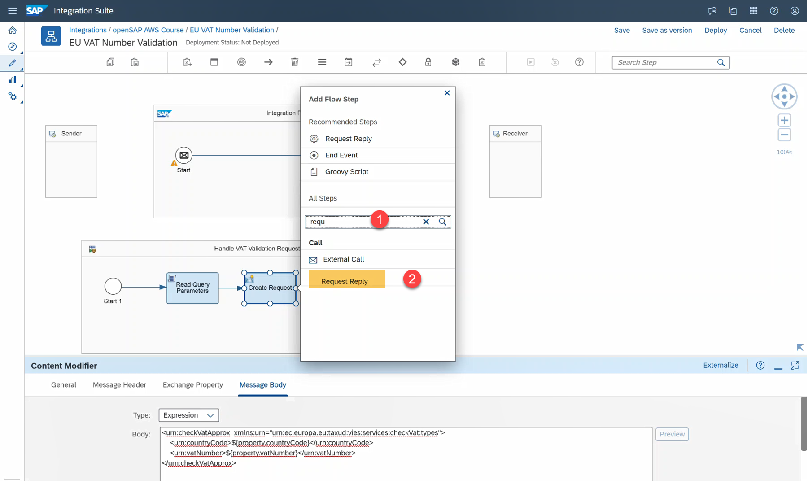
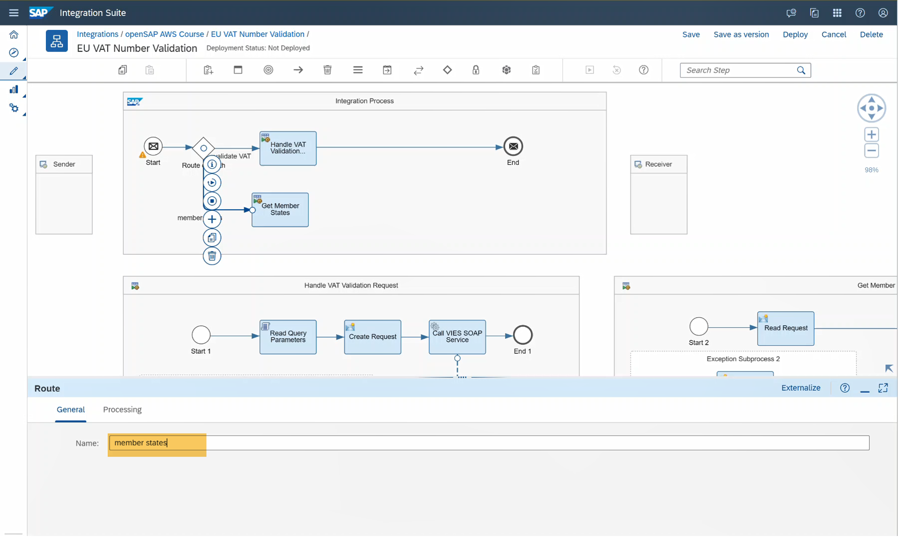
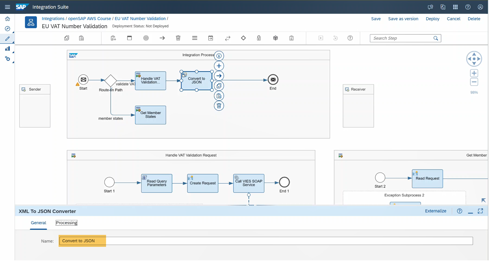
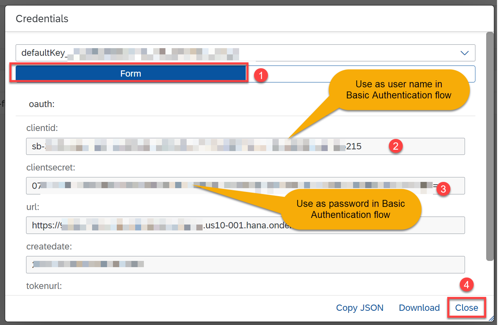
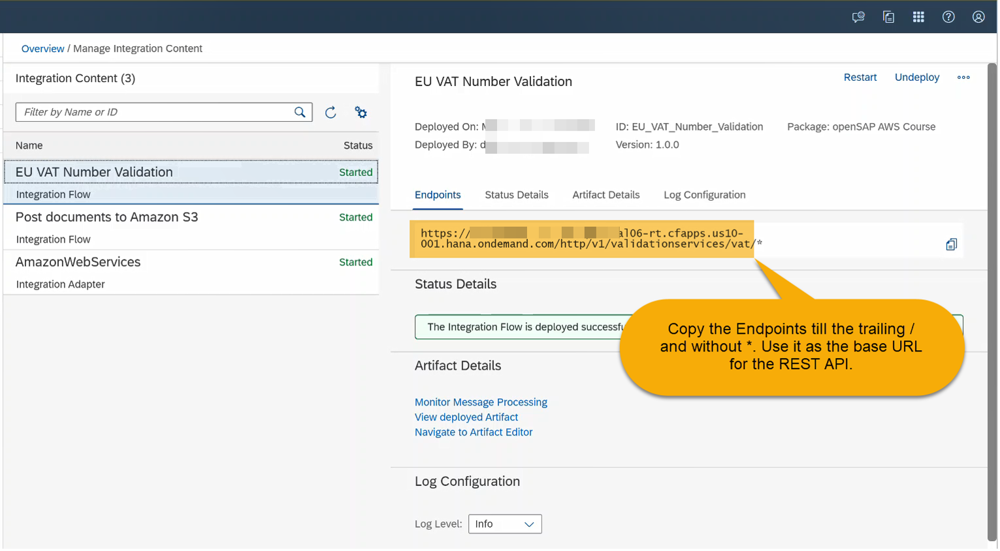

This exercise is part of the openSAP course [Building resilient applications on SAP Business Technology Platform with Amazon Web Services](https://open.sap.com/courses/aws1) - there you will find more information and context for Week 5 on Building Integration Scenarios.

# Online VAT Number Validation 
The objective of this exercise is to further your learnings from previous units with additional features of Cloud Integration and connecting PostgreSql on AWS using JDBC adapter of Cloud Integration. 

## Prerequisites
1. You have created a trial account on SAP Business Technology Platform: [Get a Free Trial Account on SAP BTP](https://developers.sap.com/tutorials/hcp-create-trial-account.html)
2. Steps to enable SAP Integration Suite in SAP BTP trial and rest of the configuration for setting the Amazon Web Services adapter, PostgresSQL related configurations is covered in the [Unit 2](../Unit%205.2/README.md) 
3. Download [EU VIEWS SOAP WSDL][(http://ec.europa.eu/taxation_customs/vies/services/checkVatService.wsdl)] to your local file location.

## Step 1 - Create EU VAT Number Validation Integration Flow

At a high level, the integration flow for Online VAT Number Validation consists of the following steps:
1.	Route incoming request based on request path.
2.	Read VAT number and member state/Norther Ireland ID from HTTP query parameter, create the SOAP request and invoke the EU VAT validation SOAP API.
3.	Set SQL statement to read member states and connect to PostgreSQL database using JDBC adapter.
4.	Handle exception scenarios to return user friendly error. 
5.	Convert response to JSON
6.	Set the response headers for JSON response.   


You can create a new Integration tutorial or alternatively use an existing integration package of your choice. In this tutorial, the integration package openSAP AWS Course created in tutorial Post documents to Amazon S3 is used.

1.1 Go to your SAP Integration Suite tenant. Select Design -> Integrations tab.Select openSAP AWS Course integration package.


1.2 Navigate to Artifacts tab and select Edit to change to edit mode.


1.3 Select Add and then select Integration Flow from the drop-down menu option.


1.4 Enter a name for your integration say EU VAT Number Validation and select Ok.


1.5 Select the newly created integration flow.


1.6 Select Edit to edit the selected integration flow.


## Step 2 - Create Local Integration Process for Calling EU VIES SOAP Service

Local Integration Process feature of Cloud Integration is used to modularize the integration packages into separate fragments. You can think of these fragments like local functions that can be invoked from your main integration. This also helps in encapsulating functionalities which can be invoked multiple times from the main process. Refer [SAP Help Portal (Cloud Integration -> Local Integration Process)](https://help.sap.com/docs/cloud-integration/sap-cloud-integration/define-local-integration-process) for more information. 

In this Local Integration Process, the following steps will be modeled. 
1.  Read member state/Norther Ireland identifier and VAT number for validation from query parameter of incoming HTTP request.
2.  Create the SOAP request from the values read in previous step.
3.  Call the EU VIES SOAP service.
4.  An exception subprocess to handle the SOAP error and return a JSON response encapsulating the SOAP error response.


2.1 Select process icon from the integration palette and select Local Integration Process and drop it to your integration canvas. Alternatively, you can search and select for Local Integration Process from Search Step field.


2.2 Change Name to Handle VAT Validation Request for improved readability.


2.3 Select the connecting arrow between the Start 1 and End 1 step of your Local Integration Process block and select + icon to add a new integration step


2.4 To read the incoming HTTP query parameters, JavaScript is used. Search and select JavaScript integration step in Add Flow Step dialog.


2.5 Change name to Read Query Parameters for improved readability. Select on Create Script icon to add new JavaScript.


2.6 Copy and paste the following JavaScript snippet into the code editor and select OK. This script reads HTTP query parameter named countryCode and vatNumber and sets it into message properties of the same name.
```js
/* Refer the link below to learn more about the use cases of script.
https://help.sap.com/viewer/368c481cd6954bdfa5d0435479fd4eaf/Cloud/en-US/148851bf8192412cba1f9d2c17f4bd25.html

If you want to know more about the SCRIPT APIs, refer the link below
https://help.sap.com/doc/a56f52e1a58e4e2bac7f7adbf45b2e26/Cloud/en-US/index.html */
importClass(com.sap.gateway.ip.core.customdev.util.Message);
importClass(java.util.HashMap);

function getParameterByName(name, url) {
    name = name.replace(/[\[\]]/g, '\\$&');
    var regex = new RegExp('[?&]' + name + '(=([^&#]*)|&|#|$)');
    var results = regex.exec(url);
    if (!results) return '';
    if (!results[2]) return '';
    return decodeURIComponent(results[2].replace(/\+/g, ' '));
}

function processData(message) {
     
    var query =  "?" + message.getHeaders().get("CamelHttpQuery");

    message.setProperty("countryCode", getParameterByName("countryCode",query));
    message.setProperty("vatNumber", getParameterByName("vatNumber",query));
    return message;
}
```


2.7 Select Read Query Parameters integration step and select + icon to add a new integration step. 


2.8 Search and select Content Modifier from Add Flow Step dialog.


2.9 Change Name to Create Request for improved readability.


2.10 Navigate to Message Body tab. Copy and paste the following snippet to create the SOAP request envelope.
```xml
<urn:checkVatApprox  xmlns:urn="urn:ec.europa.eu:taxud:vies:services:checkVat:types">
    <urn:countryCode>${property.countryCode}</urn:countryCode>
    <urn:vatNumber>${property.vatNumber}</urn:vatNumber>
</urn:checkVatApprox>
```


2.11 Select the Create Request integration step and select + to add a new integration step.


2.12 Search and select Request Reply from Add Flow Step dialog.


2.13 Change Name to Call VIES SOAP Service for improved readability.


2.14 For calling the SOAP service, a new receiver participant is required. Select Participant icon in the integration palette and select Receiver from the drop-down menu. Drag and drop the receiver into your integration canvas.


2.15 Change name to VIES for improved readability.


2.16 Select and connect the Call VIES SOAP Service integration step to the newly added Receiver. This would open the Adapter list, from the available Adapter select SOAP. Select SOAP 1.1 in the Message Protocol option dialog


2.17 Navigate to Connection tab. Enter http://ec.europa.eu/taxation_customs/vies/services/checkVatService in the Address field. To browse and select the EU SOAP service WSDL from your local file system click on Select next to the URL to WSDL field.  You can download from the WSDL from [this site](http://ec.europa.eu/taxation_customs/vies/services/checkVatService.wsdl) to your local file location beforehand.

Alternatively you can download from [here](https://github.com/anbazhagan-uma/opensap-btp-aws/blob/main/Week%205/Unit%205.4/images/checkVatService.wsdl)     


2.18 Select Upload from File System to add the EU SOAP service WSDL from your local file system.


2.19 In this tutorial, checkVatApprox operation is used. Select checkVatApprox operation from Select Port for the Service dialog. This step will automatically fill in the Service, Endpoint and Operation Name field.


2.20 Select None in the Authentication field.


2.21 Search and select the Exception Subprocess from Search step field. Drag and drop the selected step to the Handle VAT Validation Request local integration process.


2.22 Select connecting arrow between Error Start 1 and End 2 step. Select + icon to add a new integration step.


2.23 Search and select Content Modifier from Add Flow Step dialog.


2.24 Change Name to Error Handler for improved readability.


2.25 Navigate to the Message Body tab. Copy and Paste the following snippet to the Body field. This code snippet encapsulates any process exception message into a JSON response.
```json
{
"validation":"false",
"description": "${exception.message}"
}
```


Congratulation, you have successfully modeled a local integration process to create a SOAP request from the incoming query request parameters of the REST API and invoke the EU VIES SOAP service. In the next section, you will be guided through the steps to query for the list of available member states from a PostgreSQL database from AWS.

## Step 3 - Create Local Integration Process to Connect to PostgreSQL in AWS

In this Local Integration Process, the following steps will be modeled. 
1.	Set the SQL statement to read data from PostgreSQL database.
2.	Connect to the PostgreSQL database.
3.	Use JDBC adapter to connect to the PostgreSQL database in AWS.
4.	An exception subprocess to handle the JDBC error and return a JSON response.


3.1 Select process icon from the integration palette and select Local Integration Process and drop it to your integration canvas. Alternatively, you can search and select for Local Integration Process from Search Step field.


3.2 Change Name to Get Member States for improved readability.


3.3 Select the connecting arrow between the Start 2 and End 3 step of your Local Integration Process block and select + icon to add a new integration step.


3.4 Search and select Content Modifier from Add Flow Step dialog.


3.5 Change Name to Read Request for improved readability.


3.6 Navigate to the Message Body tab. Copy and paste the following SQL statement to query for the data from your PostgreSQL database in the Body field.
```sql
select * from eu.msxi
```


3.7 Select Read Request flow step and select + icon to add a new integration step.


3.8 Search and select Request Reply step from the Add Flow Step dialog.


3.9 Change Name to Call DB for improved readability.


3.10 For calling the PostgreSQL database, a new receiver participant is required. Select Participant icon in the integration palette and select Receiver from the drop-down menu. Drag and drop the receiver into your integration canvas.


3.11 Change Name to AWSRDS for improved readability.


3.12 Select and connect the Call DB integration step to the newly added Receiver. This would open the Adapter list, from the available Adapter select JDBC. 


3.13 Enter the name of your JDBC data source, say opensapawspg. Follow section Set up PostgreSQL database in Amazon of Pre-requisites tutorial to create this JDBC data source beforehand.


3.14 Search and select the Exception Subprocess from Search step field. Drag and drop the selected step to the Get Member States local integration process.


3.15 Select connecting arrow between Error Start 3 and End 4 step. Select + icon to add a new integration step.


3.16 Search and select Content Modifier from Add Flow Step dialog.


3.17 Change Name to Error Handler for improved readability.


3.18 Navigate to the Message Body tab. Copy and Paste the following snippet to the Body field. This code snippet encapsulates any process exception message into a JSON response.
```json
{
"validation":"false",
"description": "${exception.message}"
}
```


Congratulation, you have successfully modeled a local integration process to query for member states from the PostgreSQL database in AWS. In the next section, you will be guided through the steps to build the REST API and model the main integration flow.

## Step 4 - Build Check VAT Number REST API Integration Flow

4.1 Select the arrow connecting Start and End step of the main Integration Process. Select + icon to add a new integration step.


4.2 Search and Select Router from Add Flow Step dialog


4.3 Change Name to Read on Path for improved readability.


4.4 Select + icon to add a new integration step.


4.5 Search and select Process Call from Add Flow Step dialog.


4.6 Change Name to Handle VAT Validation Request for improved readability.


4.7 Navigate to the Processing tab. Click on Select button to add the required Local Integration Process flow to be invoked.


4.8 Select Handle VAT Validation Request local integration process.


4.9 Select the arrow connect to the step Handle VAT Validation Request to set the condition on which this step should be invoked by the router step. Change Name of the Route path to validate VAT.


4.10 Navigate to the Processing tab. From the drop-down select Non-XML. Copy and paste ${header.CamelHttpPath} = 'checkvatnumber' to the Condition field. This code ensures that Handle VAT Validation Request is called for REST API call /checkvatnumber.


4.11 Search and select Process Call from the search field. Drag and drop the selected step to the Integration Process canvas.


4.12 Change Name to Get Member States for improved readability.


4.13 Navigate to the Processing tab. Click on Select button to add the required Local Integration Process flow to be invoked.


4.14 Select Get Member States local integration process.


4.15 Select and connect the Route on Path integration step to the newly added Get Member States integration step.


4.16 Change Name of the Route path to member states.


4.17 Navigate to the Processing tab. From the drop-down check Default Route option. This ensures that Get Member States route is invoked as the default if no other route conditions are met.


4.18 Select the arrow connecting Handle VAT Validation Request and End step. Select + icon to add a new integration step.


4.19 Search and select XML to JSON integration step to convert the response from local integration process steps to JSON format. 


4.20 Change Name to Covert to JSON for improved readability.


4.21 Navigate to the Processing tab and select the Suppress JSON Root Element option.


4.22 Select and connect the Get Member States to Convert to JSON step. 


4.23 Select the Convert to JSON step and select + icon to add a new integration flow.


4.24 Search and select Content Modifier from Add Flow Step dialog.


4.25 Change Name to Set Response Handlers for improved readability.

4.26 Navigate to Message Header tab and select Add. From the action drop down select Create, enter Content-Type as the Name of the property, select Constant from the drop down for Source Type and enter application/json in the Source Value field


4.27 Select and connect Sender step to Start step. This will launch the available adapter list dialog. Select HTTPS from the adapter list.


4.28 Navigate to the Connection tab. Enter /v1/validationservices/vat/* in the Address field.


4.29 You can optionally select and delete the unused Receiver step.


4.30 Select Save to persist all changes in your integration flow.


4.31 Select Deploy to deploy the integration to your SAP Integration Suite tenant.


4.32 To check the deployment status of your integration flow, navigate to Monitor->Integration. Select All tile from Manage Integration Content section


4.33 Select the newly deployed EU VAT Number Validation integration flow. After the integration flow is deployed, the status will change to Started. The URL to invoke the EU VAT Number Validation REST API will also be displayed. You can copy and note down this URL to use it in the next section.


Congratulation, you have successfully created and deployed the EU VAT Number Validation integration flow, that exposes a REST API to validate the VAT number issued by a member state/Northern Ireland by invoking the EU VAT validation SOAP API.  In the next section, you will be guided through the steps to test this REST API from an external API client tool like Postman.

## Step 5 - Test EU VAT Validation REST API

In this tutorial, [Postman](https://www.postman.com/downloads/) has been used as an API test client. You can choose an API test client of your choice. 

To invoke the EU VAT Validation REST API, client id and secret is required. This client id and secret is generated by creating a service instance of the Process Integration Flow service. The Run Enable Integration Suite Booster flow of tutorial Pre-requisites automatically creates the required service keys for you in your SAP BTP trial environment. 
 
5.1 Navigate to SAP BTP trial and select option Go to Trial Account. You will be navigated to your trial account.


5.2 Select your trial sub-account, e.g., trial. You will be navigated to your BTP sub-account


5.3 Select Cloud Foundry->Spaces to view all available spaces. Select dev space or the space where the SAP Integration Suite services have been created.


5.4 Select Services->Instances and select the Instance named rt-integration-flow with integration-flow plan. Click on key link to view the created service instance.


SAP Integration Suite supports other authentication types like certificates, OAuth, Basic to connect to the integration flow. In this tutorial, for simplicity reasons Basic authentication has been used.

5.5 Select Form to switch to the form view. You can use the clientid as the username and clientsecret as the password in the connecting to the EU VAT Validation REST API using Basic authentication approach.  Copy and note the value for clientid and clientsecret field to connect to EU VAT Validation REST API from your API test client like Postman.


5.6 Open the API test client of your choice. In this tutorial, Postman was used. Therefore, the rest of the steps and related to Postman.

Select + option to start a new API request. Select GET as HTTP method. In the URL copy the EU VAT Validation Integration Flow noted from previous section and append it with /memberstates to get the identifier & description of EU member states/Northern Ireland stored in the PostgreSQL database in AWS. 
 


5.4 Change the request URL by replace /memberstates with /checkvatnumber?countryCode=DE&vatNumber=143454211. Select Send to invoke the EU VAT Validation REST API. This will trigger a SOAP request to validate the VAT Number 143454211 for member state DE (Germany) to EU VIES SOAP service. The API response will be shown in the Body field.


Congratulations, you have successfully tested the EU VAT Validation REST API from an external API client like Postman. In the next optional section, you will be guided through steps to monitor the integration flow.

## Step 6 - Trace EU VAT Number Validation Integration Flow

This is an optional section, that showcases some of the trace & monitoring features available in the SAP Integration Suite.

6.1 To set the log level to Trace for an integration flow, navigate to Monitor->Integration. Select All tile from Manage Integration Content section. 


6.2 Select the integration flow to enable trace, say EU VAT Number Validation integration flow. Change the Log Level to Trace.
 

6.3 Select Change to confirm the log level change.


6.4 The Log Level will be changed back to Info level automatically at the end of the trace expiration interval. Select Overview to navigate back to Monitor dashboard.


Test the integration as described in section 5. Test EU VAT Validation REST API

6.5 Select All Integration Flows tile from Monitor Message Processing section.


6.6 Select Trace from the latest run of the integration flow.
 

6.7 This will launch the trace message dialog. You can view all the executed steps of the integration flow, time taken in each step. You can additionally view the Log and Message Content for each integration step. 
 

Congratulation, you have successfully traced an integration flow by setting the log level to Trace. This option can help during the debugging of the integration flow to identify the error flows.
